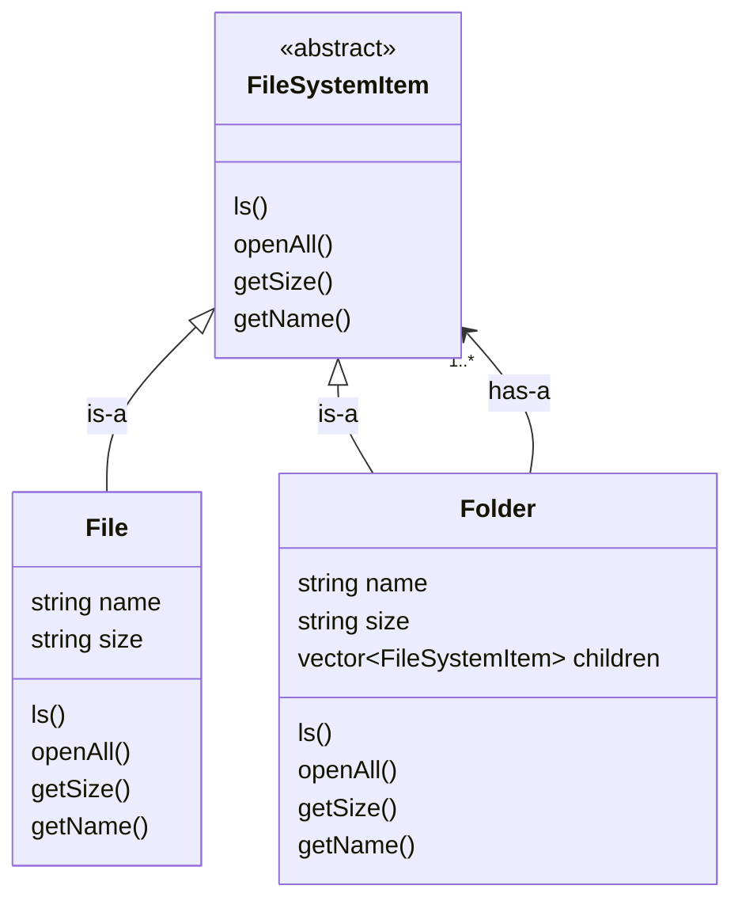
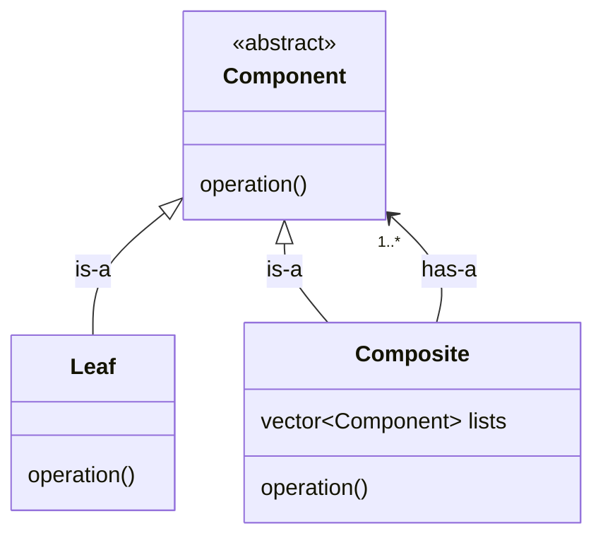

# Composite Design Pattern

**Definition**: Composite pattern compose object into tree like structure representing a part whole hierrarchy. It let client treat individual object and composition of object uniformly.

**Initial**
- File: name, size(), openup()
- Folder: name, size(), vector<File>, vector<Folder>, openup()
- We need to take two other vector as both file and folder of different class, we want to keep them in same list, but how?

```cpp
int openAll(item){
    if(typeof(item)=="File"){
        cout<<"Filename"<<endl;
    }else{
        cout<<"Foldername/" + openAll(item);
    }
}
```

**Solution**
- Both File and Folder should have same interface
- only two component : `Composite` and `Leaf`

<br>


**UML**


## Standard UML Diagram


## Code
```cpp
#include <bits/stdc++.h>
using namespace std;

class FileSystemItem{
    public:
        virtual ~FileSystemItem() {}
        virtual void ls(int intent = 0 ) = 0;
        virtual void openAll(int intent = 0 ) = 0;
        virtual int getSize() = 0;
        virtual FileSystemItem* cd(const string& name) = 0;
        virtual string getName() = 0;
        virtual bool isFolder() = 0;
};

class File : public FileSystemItem{
    private:
        string name;
        int size;
    public:
        File(const string& name, int size) : name(name), size(size) {}
        
        void ls(int intent = 0) override{
            cout<< string(intent, ' ') << name<<endl;
        }
        
        void openAll(int intent = 0) override{
            cout<< string(intent, ' ') << name<<endl;
        }
        
        int getSize() override{
            return size;
        }
        
        FileSystemItem* cd(const string& name) override{
            return nullptr;
        }
        
        string getName() override{
            return name;
        }
        
        bool isFolder() override{
            return false;
        }
};

class Folder : public FileSystemItem{
    private:
        string name;
        vector<FileSystemItem*> children;
        int size;
    public:
        Folder(const string& name) : name(name){}
        
        ~Folder(){
            for(auto c: children) delete c;
        }
        
        void add(FileSystemItem* item){
            children.push_back(item);
        }
        
        void ls(int intent = 0) override{
            cout<< string(intent, ' ') <<"+ "<< name<<endl;
            for(auto child : children){
                if(child->isFolder()){
                    cout<<string(intent+1, ' ') <<"+ "<<child->getName()<<"\n";
                }else{
                    cout<<string(intent+1, ' ') <<child->getName()<<"\n";
                }
            }
        }
        
        void openAll(int intent = 0) override{
            cout<< string(intent, ' ')<< "+ "<< name<<endl;
            for(auto child: children){
                child->openAll(intent+4);
            }
        }
        
        int getSize() override{
            int size = 0;
            for(auto child : children){
                size+= child->getSize();
            }
            return size;
        }
        
        FileSystemItem* cd(const string& target) override{
            for(auto child : children){
                if(child->isFolder() && child->getName()==target){
                    // cout<<string(intent, ' ') + child->getName()<<endl;
                    return child;
                }
            }
            return nullptr;
        }
        
        string getName() override{
            return name;
        }
        
        bool isFolder() override{
            return true;
        }
};

int main() {
    Folder* root = new Folder("root");
    root->add(new File("file1.txt", 1));
    root->add(new File("file2.txt", 1));
    
    Folder* docs = new Folder("docs");
    docs->add(new File("file3.txt", 1));
    docs->add(new File("file4.txt", 1));
    root->add(docs);
    
    Folder* images = new Folder("images");
    images->add(new File("file5.txt", 1));
    images->add(new File("file6.txt", 1));
    docs->add(images);
    
    root->ls();
    root->openAll();
    
    delete root;
    return 0;
}
```

## Real Life Example
any tree like structure lld can be solved using composite design pattern
**Examples**
- File Folder Stucture
- Menu (home, file (save(pdf, txt, excel, csv, etc)), edit(page, font, background))
