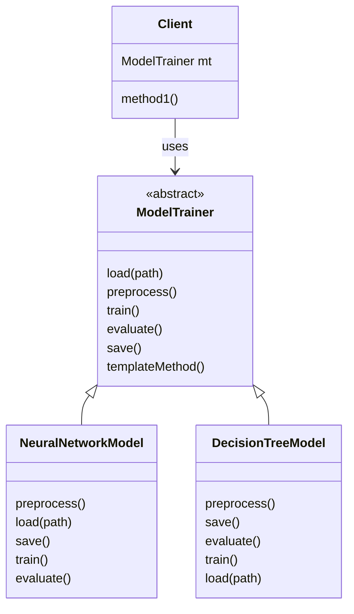
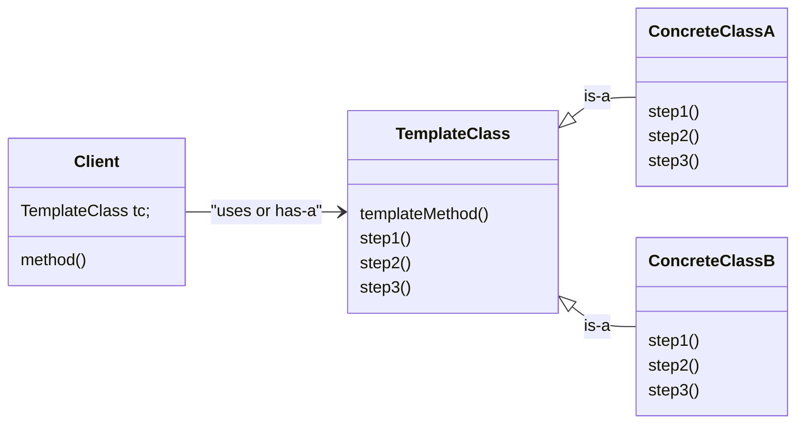

# Template Method Pattern

When we want developer should follow some pipeline, example of data scientist : load data -> preprocess data -> train model -> evaluate -> save model. 

We want that this pipline should work exactly in same order no matter what is the algorithm.

It will provide one templateMethod() that will execute the method in desired order.


**Definition**: Template Method Pattern design the skelaton of an algorithm, for an operation defering some steps to subclasses. Template Method let subclasses redefine certain steps of an algorithm without changing the algorithm structures.



```cpp
// Implementation of templateMethod in base class ModelTrainer
void templateMethod(){
    load(path);
    preprocess();
    train();
    evaluate();
    save();
}
```

## Standard UML Diagram



## Code
```cpp
class ModelTrainer{
    public:
        // Client will call this method()
        // final or const : so subclass can't change the sequence
        void trainPipeline(const string& dataPath){
            loadData(dataPath);
            preprocessData();
            trainModel();
            evaluateModel();
            saveModel();
        }
    
    // client don't need to access this methods
    protected:
        void loadData(cosnt string& path){
            cout<<"[Common] Loading dataset from "<<path<<endl;
        }

        virtual void preprocessData(){
            cout<<"[Common] Splitting into train/test and normalizing\n";
        }

        virtual void trainModel() = 0;
        virtual void evaluateModel() = 0;

        virtual void saveModel(){
            cout<<"[Common] Saving model to disk as default format\n";
        }
};

class NeuralNetworkTrainer : public ModelTrainer{
    protected:
        void trainModel() override{
            cout<<"[Neural Network] Trianing Neural Network for 100 epochs\n";
        }

        void evaluateModel() override{
            cout<<"[Neural Network] Evaluating accuracy and less on validation set\n";
        }
        
        void saveModel() override{
            cout<<"[Neural Network] Serializing network weights to .h5 file\n";
        }
};

class DeciionTreeTrainer : public ModelTrainer{
    protected:
        void trainModel() override{
            cout<<"[Decision Tree] Building decision tree with max_depth=5\n";
        }

        void evaluateModel() override{
            cout<<"[Decision Tree] Computing classification report {precision/recall}\n";
        }
};

int main(){
    cout<<"Neural Network Training-------- \n";
    ModelTrainer* modelTrainer = new NeuralNetworkTrainer();
    modelTrainer->trainPipleline("data/images");

    return 0;
}
```

### When to Use
- When multiple classes follow the same algorithm with small variations  
- When you want to prevent subclasses from changing the algorithm order  

### Structure
- **Template Method**  
  - A final method that defines the algorithm flow  
- **Primitive Operations**  
  - Abstract methods implemented by subclasses  
- **Hooks (optional)**  
  - Methods with default behavior that subclasses may override  
  

## Real Life Example (Order of Execution)
Order of Execution (pipline) is used
- Payment Transaction : validate balance, debit from sender, credit to receiver, validate transaction. ConcreteClass like Credit Card, UPI will override method according to them.
- Training different machine learning model