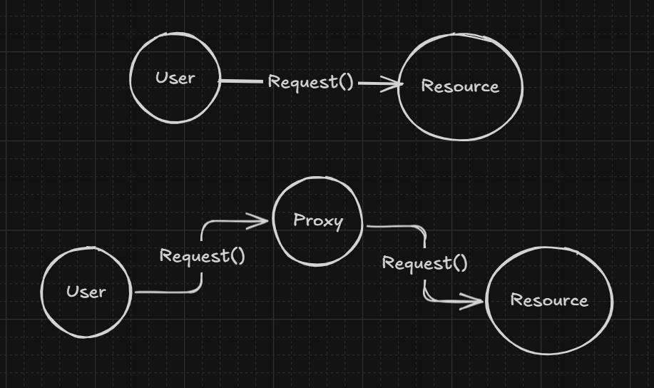
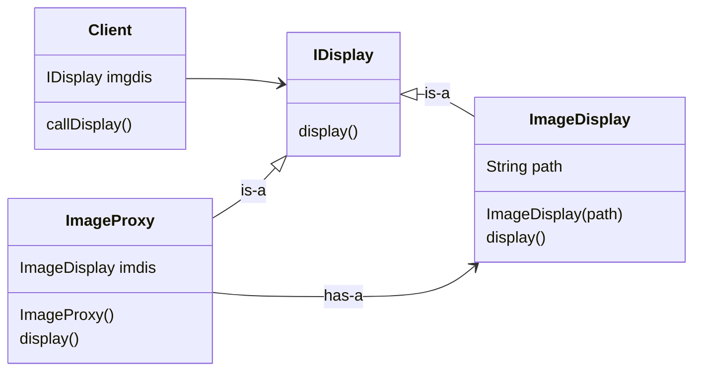
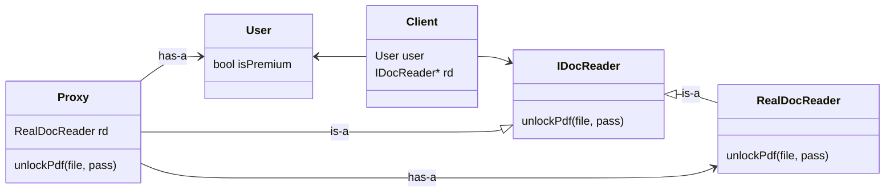
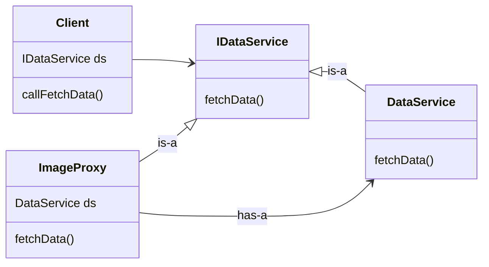
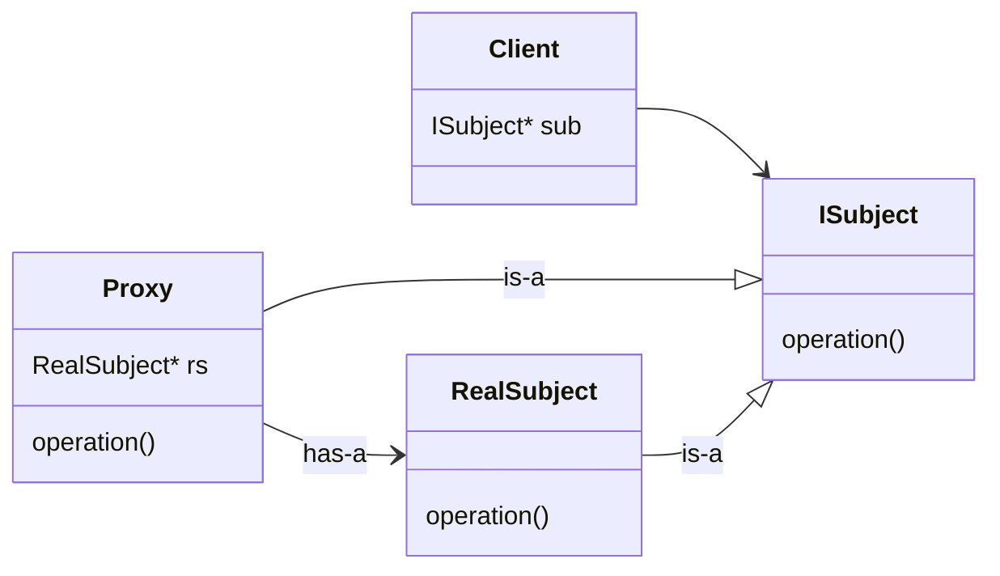

# Proxy Design Pattern

**Definition** : The Proxy Pattern Provide a surrogate or placeholder for another object to control access to it.

**Type of Proxy**
- Virtual
- Protection
- Remote

Proxy will work same in all three case

**Scenerio** : 

User make request to resource, but we don't want that user directly communicate with resource.

We will introduce proxy which will validate the request before being sent to critical resource.

User can't differentiate between proxy and resource and user don't need also.




## 1. Virtual Proxy
**Example** : Consider a scenerio where there is class `ImageDisplay` which has display() method and constructor(path)
When client create object of image then it will take path and perform operation : `load image`, `compress image`, `filter` , and when client call display() then it will display the image

But, if client create object : 
```ImageDisplay* image = new ImageDisplay(path); image-display();```
But you never used that image object, expensive operation is wasted

We will introduce proxy, that will represent this imagedisplay, which will have reference of ImageDisplay and expensive task will be performed only when display() is called

Asssumption: we dont have access to expensive operations or we can't update display() of ImageDisplay()




**one line**: protect expensive resource

Client have image object and when client call->display() then proxy will check if ImageDisplay* reference is nullptr then ImageDisplay object will be instantiate and display() method will be called

Object of ImageDisplay will be create only when any method of ImageDisplay is called for first time and then use the same object for furture use.

## 2. Protection Proxy
Consider we have feature unlockPdf() but which is only able for premium user, we will introduce proxy which will handle only premium user should able to use this feature



```cpp
// Proxy
class Proxy{
    public:
        unlockPdf(file, pass){
            if(user.isPremium){
                rd->unlockPdf();
            }else{
                cout<<"only for premium user"<<endl;
            }
        }
}
```

**One line** : Protect resource which is critical

## 3. Remote Proxy
Consider there is one class which is on another server, but client should know or client only know what to call to do the task for example fetDetail(). 
So we will introduce proxy which will handle the connection part and it has reference to the actual class

**Lazy loading** : when method of class is called then that class object is created if object reference pointer is null
**Fast loading** : create object of class as object of proxy is created



### Code for Proxy
```cpp
#include<bits/stdc++.h>;
using namespace std;

class IImage{
    public:
        virtual void display() = 0;
        virtual ~IImage(){}
};

class RealImage : public IImage{
    private:
        string filename;
    public:
        RealImage(string filename){
            this->filename = filename;
            // Heavy Operation
            cout<<"[RealImage] Loading image from disk: "<<filename<<endl;
        }

        void display() override{
            cout<<"[RealImage] Displaying image: "<<filename<<endl;
        }
};

class ImageProxy : public IImage{
    private:
        IImage* image;
        string filename;
    public:
        ImageProxy(string filename){
            this->filename = filename;
            image = nullptr;

            /* Fast Loading - RealIamge
                image = new RealImage(filename);
            */
        }

        void display() override{
            // Lazy Loading of RealImage
            if(!image){
                image = new RealImage(filename);
            }
            image->display();
        }
};

int main(){
    IImage* image1 = new ImageProxy("sample.jpg");
    image1->display();
}
```

### Standard UML Diagram


### Real Life Example
**Microservice**:
    - CartService on Server 1 also has userProxy
    - UserService on Server 2
    - UserProxy will communicate with UserService on different Server

**Bank ATM**:
    - you (client)
    - ATM Machine (proxy)
    - Bank (resource / real object)

**Firewall**:
    - your browser (client)
    - proxy server (proxy)
    - website (real object)