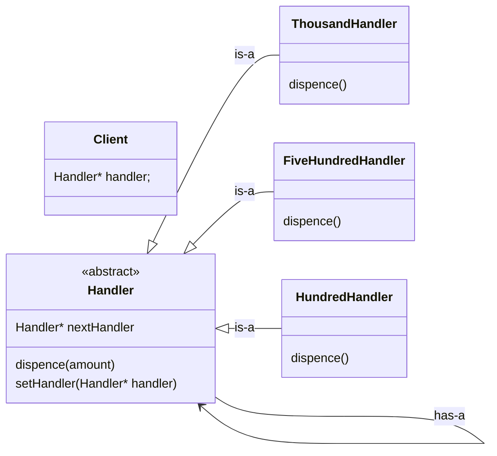
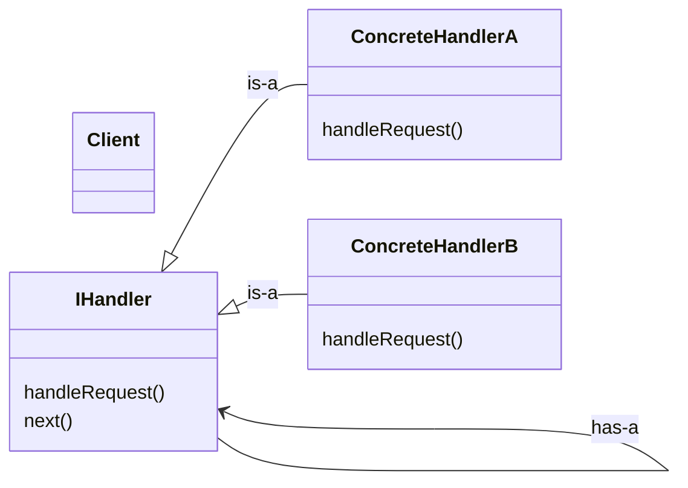

# Chain of Responsibility

**Definition**: Allows an object to pass a request along a chain of potential handlers. Each handler in the chain decide either to process the request or pass it to the next handler.

Client sent request to chain of objects :
client --request--> [ R1, R2, R3] if R1 able to fulfill then send response if not forward the request to next object (R2) and so on. (Recursively call)

Standard Example : ATM
Client ---> Dispense money [1000, 500, 100]
dispense(6000):
    1000*5 --> forward to 500
    500*2 response to client

Hnadler will have reference to Handler Interface not to concreteHandler because this will keep the loose coupling and if some handler become deprecated so in that case we can chnage the next handler dynamically with this.



### Code
```cpp
#include <bits/stdc++.h>
using namespace std;

class MoneyHandler{
    protected:
        MoneyHandler* nextHandler;
    
    public:
        MoneyHandler() : nextHandler(nullptr) {}
        
        void setHandler(MoneyHandler* handler){
            this->nextHandler = handler;
        }
        
        virtual void dispence(int amount) = 0;
        virtual ~MoneyHandler() {}
};

class ThousandHandler : public MoneyHandler{
    private:
        int numNotes;
    public:
        ThousandHandler(int numNotes) {
            this->numNotes = numNotes;
        }
        
        void dispence(int amount) override{
            int notesNeeded = amount/1000;
            
            if(notesNeeded>numNotes){
                notesNeeded = numNotes;
                numNotes = 0;
            }else{
                numNotes -= notesNeeded;
            }
            
            if(notesNeeded>0){
                std::cout << "Dispencing "<<notesNeeded<<" X $1000"<< std::endl;
            }
            
            int remainingAmount = amount - (notesNeeded*1000);
            
            if(remainingAmount>0){
                if(nextHandler) nextHandler->dispence(remainingAmount);
                else{
                    cout<<"Remaining Amount of "<<remainingAmount<<" can't be fullfilled (Insufficient cash)"<<endl;
                }
            }
        }
};

class FiveHundredHandler : public MoneyHandler{
    private:
        int numNotes;
    public:
        FiveHundredHandler(int numNotes) : numNotes(numNotes) {}
        
        void dispence(int amount) override{
            int notesNeeded = amount/500;
            
            if(notesNeeded>numNotes){
                notesNeeded = numNotes;
                numNotes = 0;
            }else{
                numNotes -= notesNeeded;
            }
            
            if(notesNeeded>0){
                std::cout << "Dispencing "<<notesNeeded<<" X $500"<< std::endl;
            }
            
            int remainingAmount = amount - (notesNeeded*500);
            
            if(remainingAmount>0){
                if(nextHandler) nextHandler->dispence(remainingAmount);
                else{
                    cout<<"Remaining Amount of "<<remainingAmount<<" can't be fullfilled (Insufficient cash)"<<endl;
                }
            }
        }
};

class HundredHandler : public MoneyHandler{
    private:
        int numNotes;
    public:
        HundredHandler(int numNotes) : numNotes(numNotes) {}
        
        void dispence(int amount) override{
            int notesNeeded = amount/100;
            
            if(notesNeeded>numNotes){
                notesNeeded = numNotes;
                numNotes = 0;
            }else{
                numNotes -= notesNeeded;
            }
            
            if(notesNeeded>0){
                std::cout << "Dispencing "<<notesNeeded<<" X $100"<< std::endl;
            }
            
            int remainingAmount = amount - (notesNeeded*100);
            
            if(remainingAmount>0){
                if(nextHandler) nextHandler->dispence(remainingAmount);
                else{
                    cout<<"Remaining Amount of "<<remainingAmount<<" can't be fullfilled (Insufficient cash)"<<endl;
                }
            }
        }
};


int main() {
	// your code goes here
	MoneyHandler* thousand = new ThousandHandler(23);
	MoneyHandler* fiveHundred = new FiveHundredHandler(42);
	MoneyHandler* hundred = new HundredHandler(63);
	
	thousand->setHandler(fiveHundred);
	fiveHundred->setHandler(hundred);
	
	int amountToWithdraw = 3800;
	thousand->dispence(amountToWithdraw);
	
	delete thousand;
    delete fiveHundred;
    delete hundred;

	
	return 0;
}
```

### Standard UML Diagram


### Real life Example
- logger : level1 (info) , level2 (debug), level3(error)
- Question with multiple hierarchy
    - leave management
        - employee --> [ tech lead --> manager --> director ]