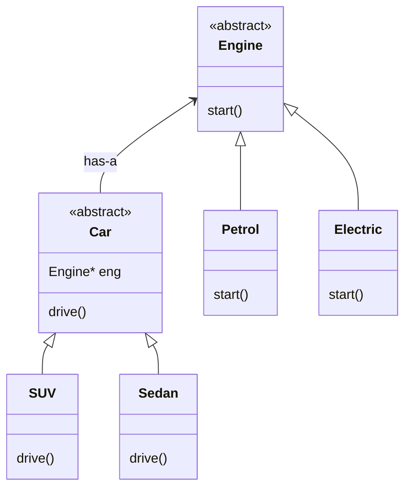
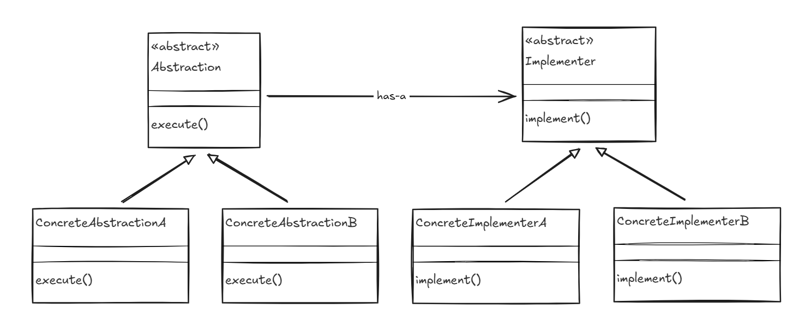

# Bridge Design Pattern

**Definition**: Bridge decouples an Abstractions from its Implementations, so that both can vary independently.

Abstraction: High Level Layer (car)
<br>
Implementation: Low Level Layer (engine)

**Scenerio**

Consider you have two class `Car` and `Engine` and many concreteClass of each, 

`Car` : SUV, Sedan

`Engine` : Petrol, Electric, Diesel, CNG

here we will require cartisian product, that is every car will have every type of engine. 

exaple : SUV with Petrol, diesel, cng, electric and so on for other car as well.
This will result in class explosion (so many classes)

if m car and n engine --> m*n classes


here Abstraction and Implementation are different than usual definition.

## Example


## Standard UML Diagram


## Code
```cpp
#include <bits/stdc++.h>
using namespace std;

class Engine{
    public:
        virtual void start() = 0;
        virtual ~Engine() {}
};

class PetrolEngine : public Engine{
    public:
        void start() override {
            cout<<"Petrol Engine Starting with Ignition..."<<endl;
        }
};

class ElectricEngine : public Engine{
    public:
        void start() override {
            cout<<"Electric Engine Starting..."<<endl;
        }
};

class Car{
    protected:
        Engine* engine;
        string model;
    public:
        // Car(Engine* eng, string model) : engine(eng), model(model) {}
        Car(Engine* eng, string model){
            this->engine = eng;
            this->model = model;
        }
        
        virtual void drive() = 0;
};

class Suv : public Car{
public:
    Suv(Engine* eng, string model)
        : Car(eng, model) {}   // ✅ correct

    void drive() override{
        engine->start();
        cout<<"Driving the Luxury "<<model<<" SUV"<<endl;
    }
};

class Sedan : public Car{
public:
    Sedan(Engine* eng, string model)
        : Car(eng, model) {}   // ✅ correct

    void drive() override{
        engine->start();
        cout<<"Driving the Sexy "<<model<<" Sedan"<<endl;
    }
};


int main() {
    Engine* petrolEngine = new PetrolEngine();
    Engine* electricEngine = new ElectricEngine();
    
    Car* sedan = new Sedan(petrolEngine, "bmw x5");
    Car* suv = new Suv(electricEngine, "mahindra BE6E");
    
    sedan->drive();
    suv->drive();

    delete sedan;
    delete suv;
    
    return 0;
}
```

### Bridge vs Strategy
Although the UML diagrams of the **Bridge** and **Strategy** patterns may look similar, their intent and usage are different.

In the **Strategy pattern**, the **client** selects an algorithm at runtime. The chosen strategy can be changed dynamically over time, allowing the behavior of an object to vary independently from the client that uses it.

In contrast, the **Bridge pattern** separates an abstraction from its implementation so that **both can vary independently**. The client typically works with the abstraction and is unaware of the concrete implementation. While different implementations can be provided, the binding between abstraction and implementation is usually established at creation time and is not meant to change frequently during runtime.

In short:
<br>
**Strategy** focuses on choosing and swapping algorithms dynamically.
<br>
**Bridge** focuses on decoupling abstraction from implementation to avoid class explosion.

Strategy: You have multiple ways to do the same thing, and you want to choose between them dynamically.
<br>
Bridge: You have two dimensions of change and don’t want an inheritance explosion.

## Real World Use case

**Hardware Example**

**Remote and Device** : Sony TV (LED, LCD, OLED) and Sony Remote (Normal, Touch Screen, Netflix)
<br>
As both remote and TV are of same company so all TV types should be able to use All type remote
<br>
Pair<Tv, Remote>

Why This Is a Bridge (Not Strategy)
- The remote doesn’t care which device it controls.
- The device doesn’t care which remote controls it.
- You can add:
    - a new device without changing remotes
    - a new remote without changing devices

The abstraction and implementation vary independently — that’s the key idea of Bridge.

**Software Exmaple**

**GUI (abstraction) and OS (Implementation)** : GUI (checkbox, dropbox, radio) and OS (windows, linux, mac)

