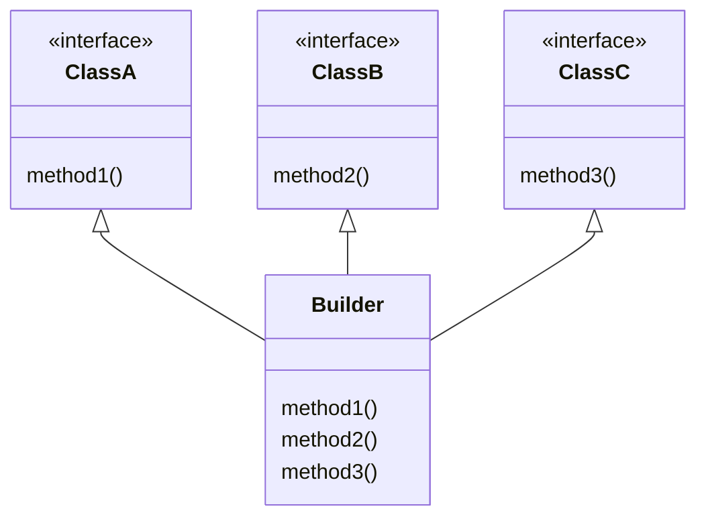
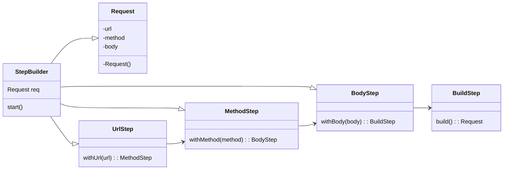
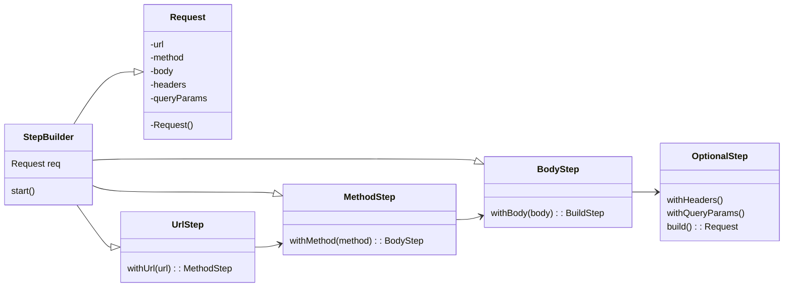

# Builder Design Pattern

**Definition** : Builder seprates the construction of a complex object from its representation.

We prefer builder design pattern when we have to create an object with many optional parameters. It is a creational design pattern that separates the construction of a complex object from its representation. It is used to construct a complex object step by step and the final step will return the object.

To create object we use `Target* target = new Target();`

**Problem with this approach:**
- It is not flexible to 
    - add new parameters.
    - remove parameters.
    - change the order of parameters.
    - change the type of parameters.
    - change the default values of parameters.
    - change the name of parameters.
    - change the number of parameters.
    - change the visibility of parameters.
    - change the access level of parameters.
    - change the scope of parameters.
    - change the lifetime of parameters.
    - change the storage of parameters.
    - change the initialization of parameters.
    - change the assignment of parameters.
    - change the evaluation of parameters.
    - change the binding of parameters.
    - change the passing of parameters.
    - change the returning of parameters.
    - change the throwing of parameters.
    - change the catching of parameters.
    - change the handling of parameters.
    - change the logging of parameters.
    - change the debugging of parameters.

**HTTPRequest Example**
<br>
HTTPRequest contains : URL, Method, Headers, Body, Query Params, Timeout

```cpp
class HTTPRequest{
private:
    string url;
    string method;
    map<string, string> headers;
    string body;
    map<string, string> queryParams;
    int timeout;
public:
    // ***************** Constructor Overloading ***************** 
    // Constructor with all parameters
    HTTPRequest(string url, string method, map<string, string> headers, string body, map<string, string> queryParams, int timeout){
        // Set all the variables value provided in params
    }

    // Constructor with only url, body and method
    HTTPRequest(string url, string method, map<string, string> headers, string body){
        // Set all the variables value provided in params
    }

    // Constructor with only url and method
    HTTPRequest(string url, string method){
        // Set all the variables value provided in params
    }

    void execute(){
        // Actual HTTP Call
    }
}
```

### Problem with this approach

#### 1. Constructor Overloading (Telescoping)
When `Client` want to create object with all parameter or only url and method parameter, it can use constructor of tha parameter.

But if we want to create object with different parameter, we need to create new constructor. This is not flexible.

This result to many constructor and it is not maintainable.

#### 2. Mutable Object
When we create object with constructor, we can't change the value of the object. We need to create new object with new value. This is not flexible.

#### 3. Inconsistent State
When we create object with mandatory parameter, and want some more variable to be set, before runing execute() method, but we forgot to set some variable, it will result to inconsistent state. --> validation before execute() method is required.

#### 4. Runtime Error
If we forgot to set some variable, it will result to runtime error. We can't find this error at compile time.

#### 5. Scattered Validation

## Code

## 1. Simple Builder 
### Problem Code
[Problem Code in C++](DesignPatternCode/BuilderPatternProblem.cpp)

### Solution Code
[Solution Code in C++](DesignPatternCode/BuilderPattern.cpp)


- This solves :
    - Constructor Overloading (Telescoping)
    - Mutable Object
    - Inconsistent State
    - Runtime Error
    - Scattered Validation

## 2. Builder with Director (Enhanced)
When we have default state of target object, which we want to crreate either of them like (D1, D2, D3), here we can use Director (manage builder) to create object with default state.

### Standard UML 


**Code** : 
[Builder with Director C++ Code](DesignPatternCode/BuilderWithDirector.cpp)


## 3. Step Builder
Consider going to pizza shop, and to get pizza, baker ask step by step-> Crust-> Sauce-> Toppings-> Cheese

**Solve Problem :**
<br>
- Step wise Building (defined step), which was not possible in other two builder
- required field

**TradeOff** : Use Multiple Inheritance

`Builder` will override all the method() as all its parent class are `abstract-class` or `interface`


### Simple Understanding (Step Builder)
```cpp
/*
    Pehle Bilder ke andar target calss ke sare setter the to client kisi bhi order me attributes ko set kar raha tha, par hume ek specific order me chahiye
    Isliye hum use kar rahe step builder, yaha har attribute ke ek abstract class hoga unke set method ke sath aur wo next attribute ke abstract class ko return karega and last attribute ka abstract class return karega ek naye abstract class : buildStep ka aur uske pass hoga build() method
*/
```

#### If all Attributes are Required


#### If also have Optional Attributes


### Code
[Step Builder C++ Code All Required and Optional Both](DesignPatternCode/StepBuilder.cpp)

### Standard UML 
