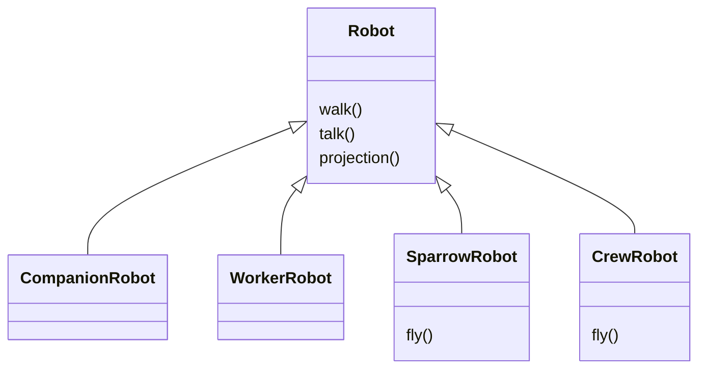
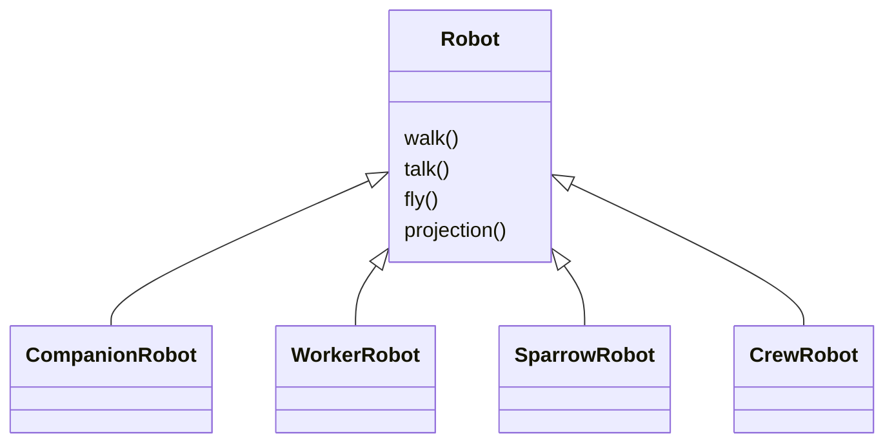
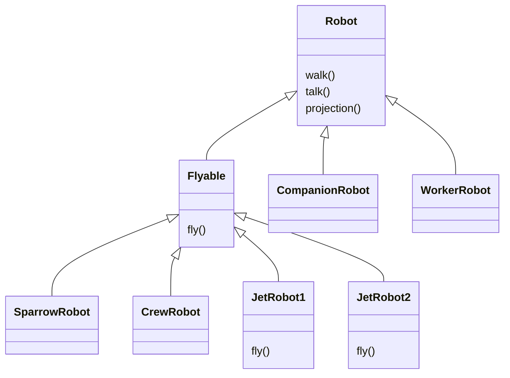
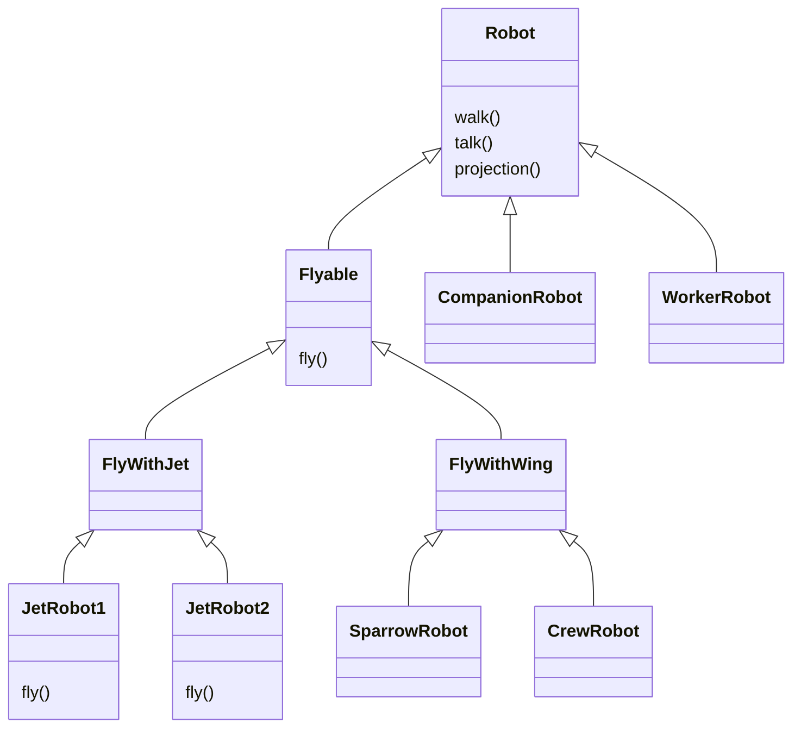
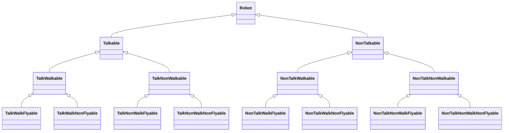
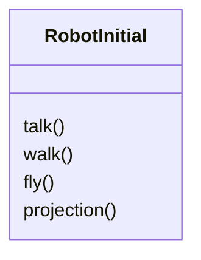
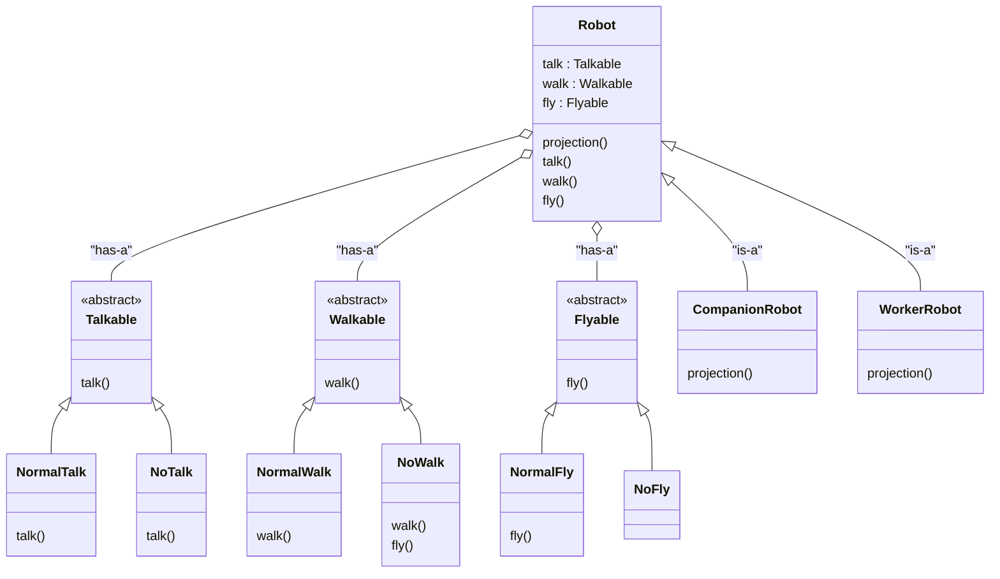
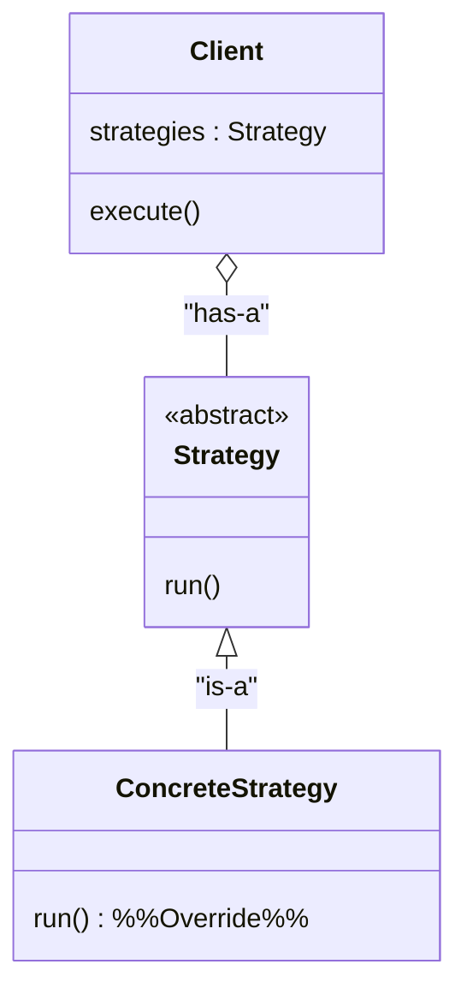

# Strategy Pattern

## Initial Case
- `Robot` : walk(), talk(), abstract method - projection()
- `CompanionRobot : Robot` and `

**Way1: fly() in concrete classes**

- This will voilate **DRY (Do not Repeate Yourself) Principle** , as fly() is written in every class which has fly behaviour.

**way2: fly() in parent class**

- Thus we will give fly() behaviour to Parent `Robot` class
- This will break `Dependency Inversion Principle` as fly() is not needed in `CompanionRobot` and `WorkerRobot` class.

**Way3: Inheritance**

- **here** JetRobot1, JetRobot2 will fly() but it there own way (using jet and both have different projection), again fly() repeated in both JetRobot class and DRY Principle is break.

**Way4: Solution of Way3 (extend JetWay)**

- And this behavior continue, some new robot come that will NonWalkable, NonTalkable and so on

**Way5: Problem Continues**

- and so on, so inheritance is not the solution here
- **Note** The solution to Inheritance is not more Inheritance

### Problems with Inheritance
- Code Reusability
- To add new feature lots of changes need to make
- Break Open Close Principle

## Strategy Design Pattern
- Define a family of algorithm, put them into seperate classes so that they can be changed at runtime.


- `talk()`, `walk()` and `fly()` are that is changing and `projection()` is same as it will be override by each class.
- so we will take out the chaning mehtods, keep only which does not change

- **Here** We are using Composition over Inheritance
- `Robot` is dumb object now : dont' do any work from it own, delegate to other classes
    - for talk() --> Talkable
    - for walk() --> Walkable
    - for fly() --> Flyable

```cpp
int main(){
    Robot* robot = new CompanionRobot(new NormalTalk(), new NoWalk(), new NormalFly());
    // Here we can change at runtime
}
```

### Notes
- Favor Composiiton over Inheritance
- Encapsulate the methods that varies

## Code
[Strategy Design Pattern Example C++ Code](DesignPatternCode/StrategyPattern.cpp)

## Standard UML Diagram of Strategy Pattern


## Real Life usecase
### Payment Method (has-a)
- UPI : pay()
- Card : pay()
- Net Banking : pay()

### Sorting Class (DSA Example)
- Insertion <--is a-- NormalInsertionSort, RandomizedInsertionSort
- MergeSort <--is a-- NormalMergeSort, RandomizedMergeSort


## Conclusion
- Encapsulate what changes and keep it seperate from what remain same.
- Solution to Inheritance is : not more inheritance
- Composition should be favored over Inheritance
- Code to Interface and not to Concretion
- Do Not Repeate Yourself