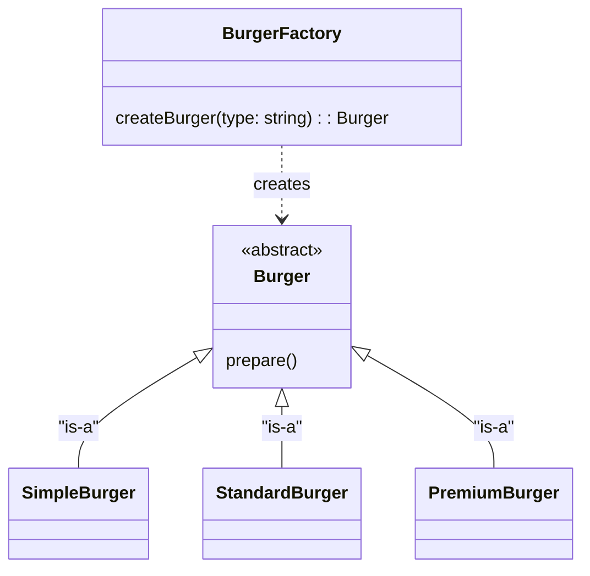
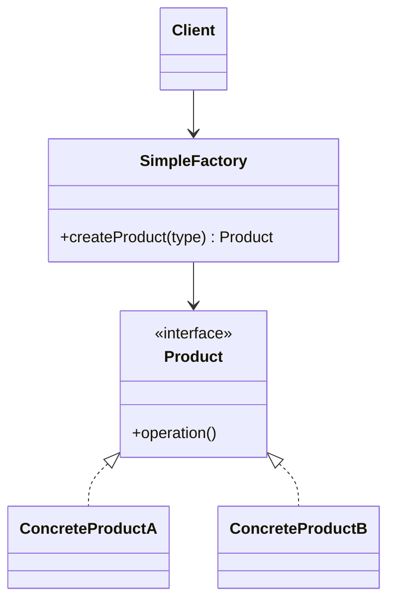
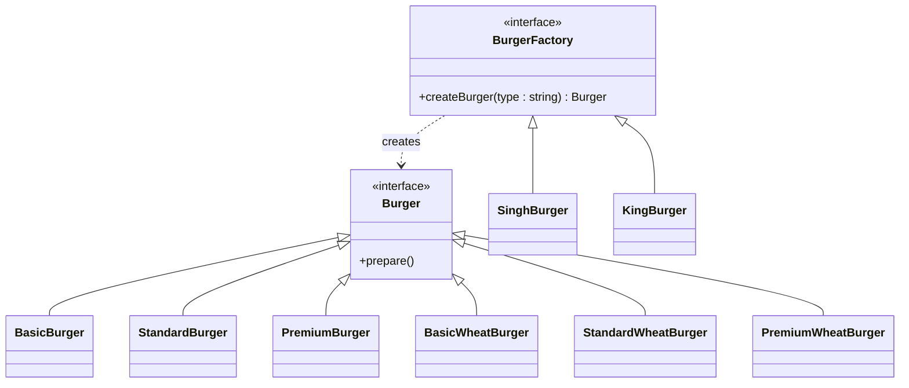
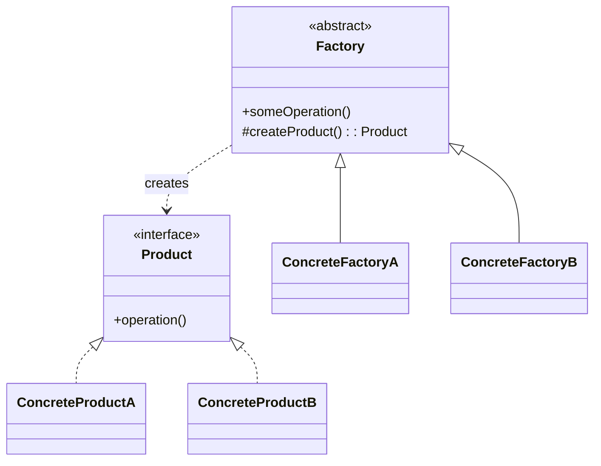
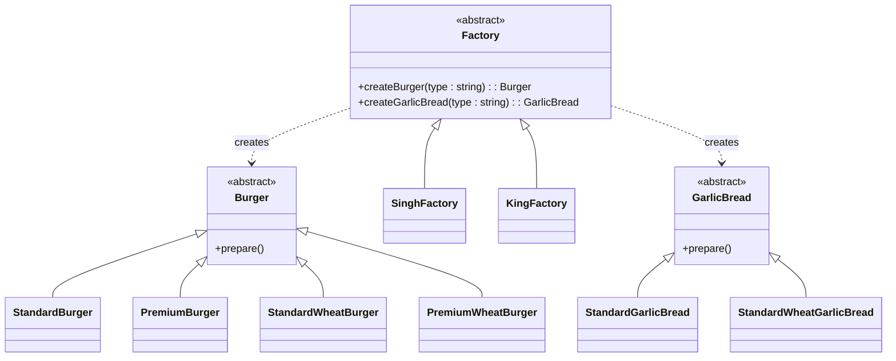
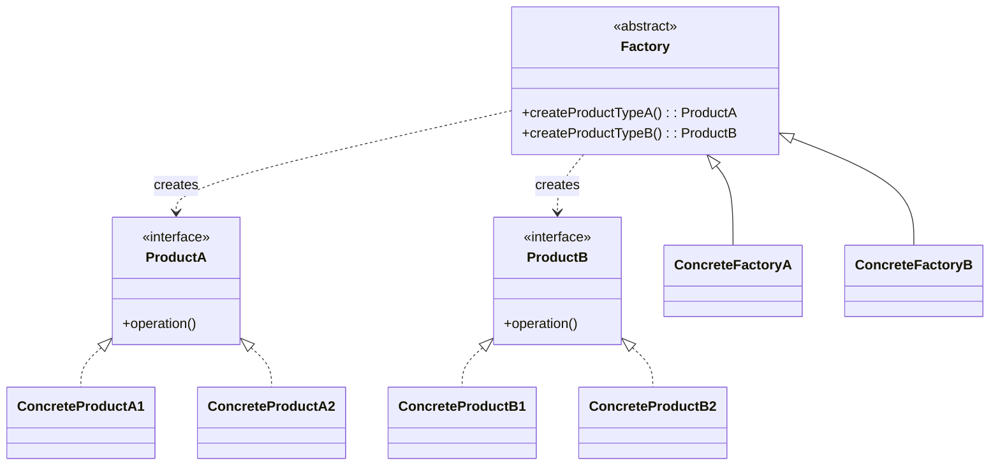

# Factory Design Pattern

We have seen in strategy design pattern that Robot class have dependency : `TalkableRobto`, `WalkableRobot`, `FlyableRobot` and there object is already been created somewhere.
<br>
here in Factory Design Pattern we will keep that object creation logic seperate from Business logic.

**Aim** : Seperate Bussiness Logic with Object creation logic

**Types**
- Simple Factory
- Factory Method
- Abstract Factory Method

## Simple Factory
Its not actually a design pattern it is a Design Principle
**Defination** : Factory Class which decide which concrete class to intantiate.
### Example

```cpp
#include <bits/stdc++.h>
using namespace std;

class Burger{
    public:
        virtual void prepare() = 0;
};

class SimpleBurger : public Burger{
    public:
        void prepare() override{
            cout<<"Preparing Baisc Burger\n";
        }
};

class StandardBurger : public Burger{
    public:
        void prepare() override{
            cout<<"Preparing Standard Burger\n";
        }
};

class PremiumBurger : public Burger{
    public:
        void prepare() override{
            cout<<"Preparing Premium Burger\n";
        }
};

class BurgerFactory{
    public:
        Burger* createBurger(string type){
            if(type=="basic"){
                return new SimpleBurger();
            }else if(type=="standard"){
                return new StandardBurger();
            }else if(type=="premium"){
                return new PremiumBurger();
            }else{
                cout<<"Invalid Burger type"<<endl;
                return nullptr;
            }
        }
};

int main() {
    string type = "standard";
    
    BurgerFactory* myBurgerFactory = new BurgerFactory();
    
    Burger* burger = myBurgerFactory->createBurger(type);
    burger->prepare();
    
    return 0;
}
```

### Standard UML Diagram


## Factory Method
Earlier there was only one factory, but we can have multiple Factory as well, like multiple Store (different) that create Burger

**simple**: Let each concrete type decide how it should be created.

**Defination** : Define interface for creating object, but allow subclass to decide which class to instantiate.

### UML


### Code
[Factory Method C++ Code](DesignPatternCode/FactoryMethod.cpp)

### Standard UML Diagram


## Abstract Factory Method
Factory when have more than one product -> abstract factory method
**Definatoin** : Provide a Interface for creating families of related objects without specifying there concrete classes. 

### UML Diagram


### Code 
[Abstract Factory Method C++ Code : MealFactory (Burger, GarlicBread)](DesignPatternCode/AbstractFactoryMethod.cpp)

### Standar UML Diagram


## Thumb Rule to Decide Strategy Or Factory Design Pattern
- Use Factory when the question is “Which object should I create?”
- Use Strategy when the question is “How should this object behave?” : means object already created somewhere in the code

## Quick Desicion Table
| Question you’re asking                                                   | Use          |
| ------------------------------------------------------------------------ | ------------ |
| Do I need to **create different implementations** based on input/config? | **Factory**  |
| Do I need to **switch algorithms/behavior at runtime**?                  | **Strategy** |
| Is the variation about **object creation**?                              | **Factory**  |
| Is the variation about **object behavior**?                              | **Strategy** |
| Do I want to **hide complex construction logic**?                        | **Factory**  |
| Do I want to **replace logic without changing the client**?              | **Strategy** |
