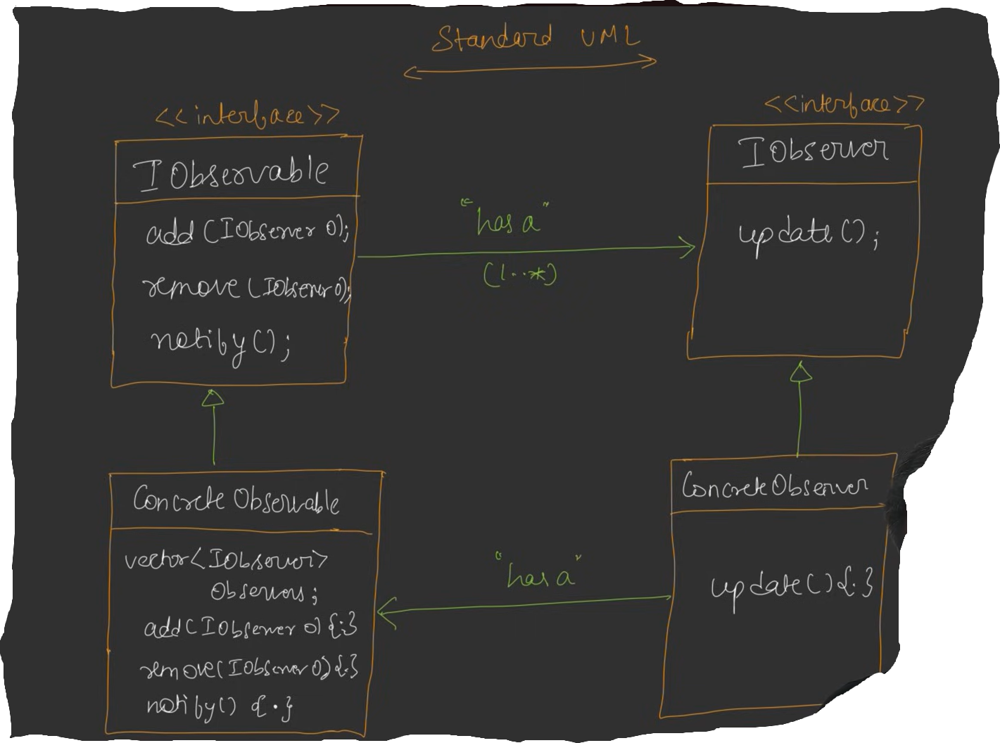
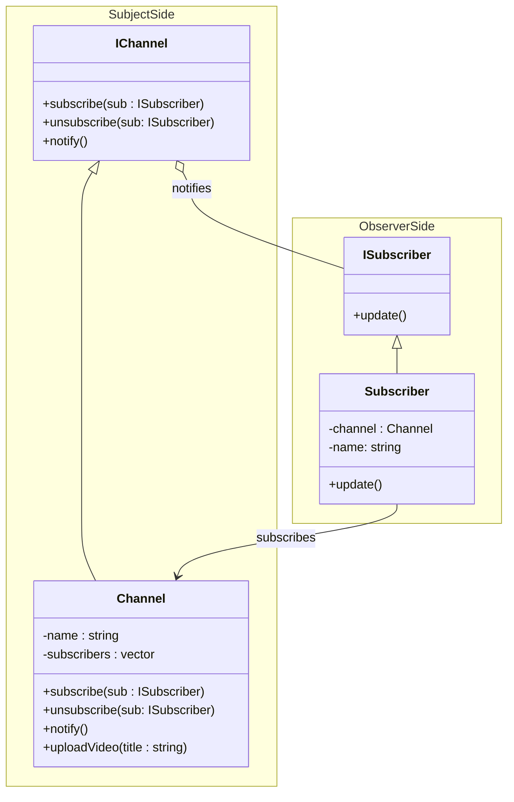

# Observer Design Pattern
Observer design pattern ek specific problem ko solve karta hai, i.e : problem - jab bhi ek object change hota hai to baki object janna chahte hai ki wo kab change hua kya value hai jab change hua.

**Example**: youtube channel (yt), subscriber(s1,s2,s3,s4) when `yt` change its state (eg new video upload), all subscriber will get notificaiton for new video

## Defination
Define One to Many relationship between objects, so that when one object change state, all of its dependents are notified and updated automatically

Observable (yt), Observer(s1,s2,s3,s4)

## Standart UML Diagram


- Observable will have Observer, when update : Observer.update()
- ConcreteObserver will have ConcreteObservable, value of ConcreteObservable have changed

## Example


- when Video gets uploaded, `uploadVideo()` will call `notify()` internally and `notify()` will take the list of `subscriber` and call there update()

### Code
```cpp
#include <bits/stdc++.h>
using namespace std;

// Abstract Observer Interface
class ISubscriber{
    public:
    virtual void update() = 0;
    virtual ~ISubscriber() {}
};

// Abstract Subject Interface
class IChannel{
    public:
    virtual void subscribe(ISubscriber* subscriber) = 0;
    virtual void unsubscribe(ISubscriber* subscriber) = 0;
    virtual void notifySubscriber() = 0;
    virtual ~IChannel() {}
};

// Concrete Subject
class Channel : public IChannel{
    private:
        string name;
        vector<ISubscriber*> subscribers;
        string latestVideo;
    
    public:
        Channel(const string& name) : name(name) {}
        
        void subscribe(ISubscriber* subscriber) override{
            if(find(subscribers.begin(), subscribers.end(), subscriber) == subscribers.end()){
                subscribers.push_back(subscriber);
            }
        }
        
        void unsubscribe(ISubscriber* subscriber) override{
            auto it = find(subscribers.begin(), subscribers.end(), subscriber);
            if(it != subscribers.end()){
                subscribers.erase(it);
            }
        }
        
        void notifySubscriber() override{
            for(ISubscriber* sub: subscribers){
                sub->update();
            }
        }
        
        void uploadVideo(const string& title){
            cout<<"Uploading Video - Title: "+title<<endl<<endl;
            latestVideo = title;
            notifySubscriber();
        }
        
        string getVideoData(){
            return "Checkout new video of "+name+" : " +latestVideo+ "\n";
        }
};

class Subscriber : public ISubscriber{
    private:
        string name;
        Channel* channel;
        
    public:
        Subscriber(const string& name, Channel* channel){
            this->name = name;
            this->channel = channel;
        }
        
        void update() override{
            cout<<"Hello "+name+" | " + channel->getVideoData()<<endl;
        }
};

int main() {
    Channel* channel = new Channel("CodeKarloGuys");
    Subscriber* Subscriber1 = new Subscriber("Sadanand Jaiswal", channel);
    Subscriber* Subscriber2 = new Subscriber("Simran", channel);
    
    channel->subscribe(Subscriber1);
    channel->subscribe(Subscriber2);
    
    channel->uploadVideo("SOLID Principles in one video");
    
    channel->unsubscribe(Subscriber2);
    
    cout<<"\n******************************************\n";
    
    channel->uploadVideo("Strategy Design Pattern, simple and best friendly content");
}
```

## Note
- **Observer Desing Pattern** break `Single Responsibility Principle` , ConcreteSubject (Channel) have functionality of Notifying and Uploading, Get Video

## Real Life Example
- Notification Service
- News Feed Service 
- Event handeling

