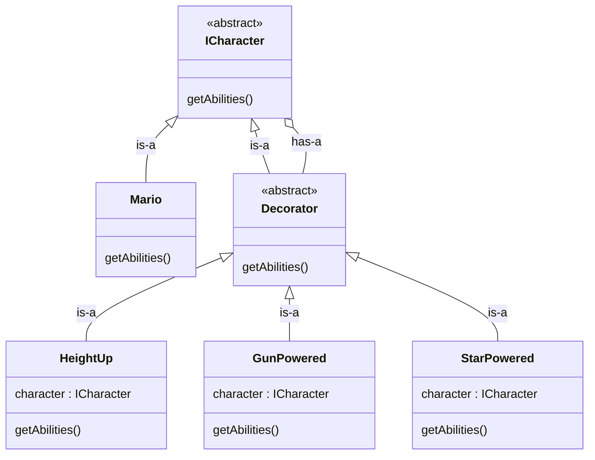
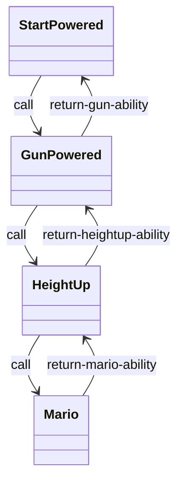
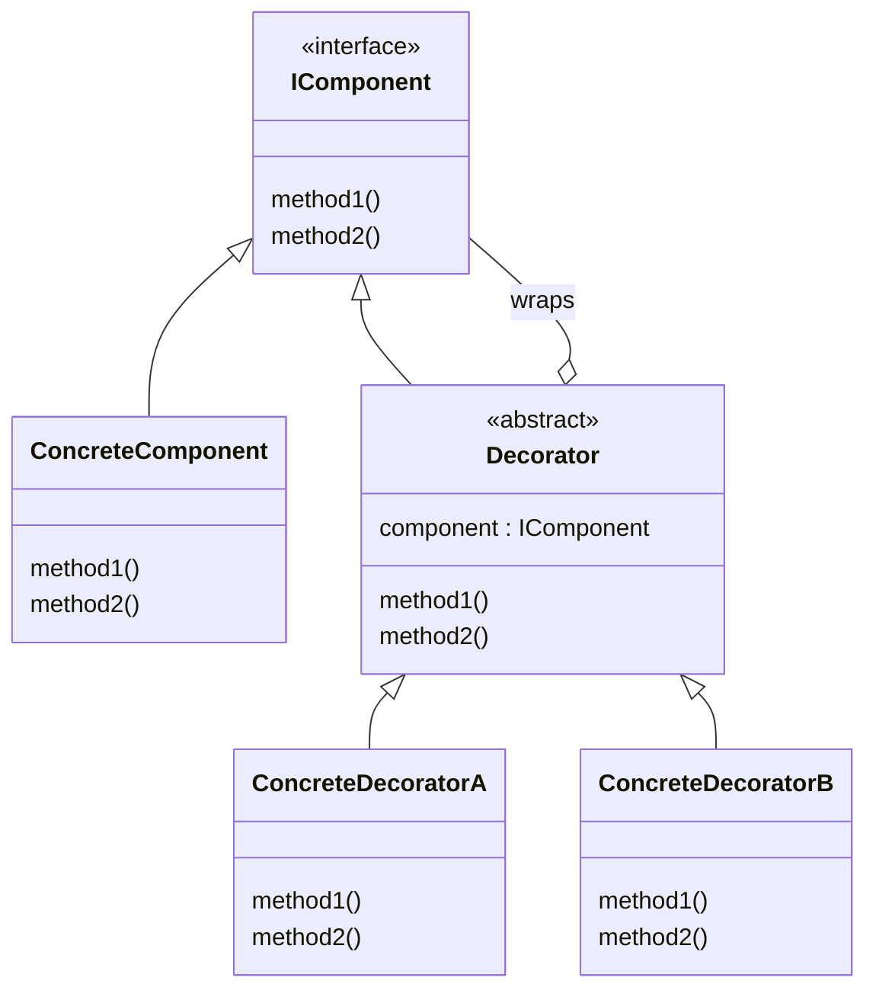

# Decorator Design Pattern
**Definition** : Decorator Pattern attaches additional responsibilites to an object dynamically, Decorator provides a flexible alternative to subclassing for extending functionality.

## Initial Case
- Consider 1 Object : `obj1` and it has method: `doSomething()` which return `I did something`
- Now we want to change the output dynamically 
- first thought: we have inheritance, we can dynamically change the behaviour

```java
import java.util.*;

class Base{
    public void run(){
        System.out.println("Running");
    }
}

class Child extends Base{
    public void run(){
        System.out.println("Running with skates");
    }
}

class Decorator{
    public static void main(String[] args){
        String type="base";
        Base b;
        if(type=="base"){
            b = new Base();
        }else{
            b = new Child();
        }
        b.run();
    }
}
```
Here we are chnaging the behaviour at runtime. This look fine, but if we extend the behaviour 

**question**: If we are able to do with normal inheritance then why we need decorator pattern? 
Inheritance is Bad (multiple heirarchy, class explosion, etc)

### Example : Mario game
- behaviour : heightUp(), gunShooting(), starAbility()
- we want to enhance the ability of mario at runtime
- Inheritance: MarioWithHeightUp{}, MarioWithGun{}, MarioWithStarAbility{}
- But we also want : MarioWithHeightUpAndGun{}, MarioWithStarAndGun{} and so on
- This will create class explosion and we need to create lots of class for different behabiour different class : Inheritance is bad - use Composition over Inheritance
- To solve this we will use Decorator Pattern

### Decorator Pattern 
- object1 : doSomething() : "I did something"
- decorator1 : do Something() : "I did somethin amazing"
- we will wrap object1 in decorator1 and so on we can infinitely stack up
- decoratorn(...docorator1(object1()))
- decorator1->doSomething() will call object1->doSomething() 

- we can call doSomething() from object1 which we can call from decorator1 also : inheritance is there
- inheritance: because decorator can behave like object
- also there composition : to change the behaviour



**Now** we can make any combination using decorator

## Code
```cpp
#include <bits/stdc++.h>
using namespace std;

class Character{
    public:
    virtual string getAbilities() const = 0;
    virtual ~Character() {}
};

class Mario : public Character{
    public:
        string getAbilities() const override{
            return "Mario";
        }
};

class CharacterDecorator : public Character{
    protected:
        Character* character;

    public:
        CharacterDecorator(Character* character) : character(character) {}
        
        virtual ~CharacterDecorator() {
            delete character;
        }
};

class HeightUp : public CharacterDecorator{
    public:
        HeightUp(Character* c) : CharacterDecorator(c) {}

        string getAbilities() const override{
            return character->getAbilities() + " with HeightUp";
        }
};

class GunPowerUp : public CharacterDecorator{
    public:
        GunPowerUp(Character* c) : CharacterDecorator(c) {}

        string getAbilities() const override{
            return character->getAbilities() + " with Gun";
        }
};

class StarPowerUp : public CharacterDecorator{
    public:
        StarPowerUp(Character* c) : CharacterDecorator(c) {}

        string getAbilities() const override{
            return character->getAbilities() + " with Star";
        }
};

int main(){
    // This mario character have heightUp ability
    Character* mario = new HeightUp(new Mario());
    cout<<mario->getAbilities();

    cout<<"\n********************************\n";

    // Mario with Gun, Start, Height Powered
    Character* marioStarGunHeight = new StarPowerUp(new GunPowerUp(new HeightUp(new Mario())));

    cout<<marioStarGunHeight->getAbilities();
}
```

Its like recursion but in different classes



## Standard UML Diagram



<br>

**Note**: In reallife order matter 

Example: 
- Encrypt --> Log : useless, on log we will get encrypted value use less for log
- correct is : Log --> Encrypt