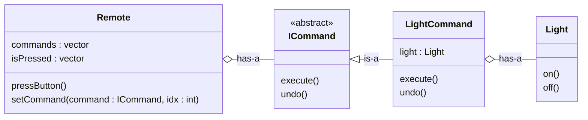

# Command Design Pattern

**Defination**: Encapsulate a request as a an object, threby letting you parameterized clients with different request, queue or log request and support undoable operations.

Rater than directly sending the request from `sender` object to `receiver` object, we use `command` object in between of two.

**Why** : Loose Coupling, Allow undo/redo

## Example: Smart Home Automation
- Remote : button1 - on light, button2 - on fan, button3 - on ac
- If we chnage : button1 - on ac -----change to remote implementation class----> break OCP

```cpp
class Remote{
    private:
        Light* light;
    public:
        void pressLightButton(){
            light->on();
        }
}
```
**Here** Remote is tightly coupled

### UML


### Code
```cpp
#include <bits/stdc++.h>
using namespace std;


// Command Interface
class Command{
    private:

    public:
        virtual void execute() = 0;
        virtual void undo() = 0;
        virtual ~Command () {}
};

// Receiver
class Light{
    private:

    public:
        void on(){
            cout<<"Light is On..\n";
        }
        void off(){
            cout<<"Light is off..\n";
        }
};
class Fan{
    private:

    public:
        void on(){
            cout<<"Fan is On..\n";
        }
        void off(){
            cout<<"Fan is off..\n";
        }
};
class AC{
    private:

    public:
        void on(){
            cout<<"AC is On..\n";
        }
        void off(){
            cout<<"AC is off..\n";
        }
};

// Concrete Command for Light
class LightCommand : public Command{
    private:
        Light* light;
    public:
        // LightCommand(Light* light) : light(light) {}
        LightCommand(Light* light){
            this->light = light;
        }
        void execute(){
            light->on();
        }
        void undo(){
            light->off();
        }
};

// Concrete Command for Fan
class FanCommand : public Command{
    private:
        Fan* fan;
    public:
        FanCommand(Fan* fan) : fan(fan) {}
        void execute(){
            fan->on();
        }
        void undo(){
            fan->off();
        }
};

// Concrete Command for AC
class ACCommand : public Command{
    private:
        AC* ac;
    public:
        ACCommand(AC* ac) : ac(ac) {}
        void execute(){
            ac->on();
        }
        void undo(){
            ac->off();
        }
};

class RemoteController{
    private:
        int size;
        vector<Command*> buttons;
        vector<bool> buttonPressed;
    public:
        RemoteController(int size)
            : size(size),
              buttons(size, nullptr),
              buttonPressed(size, false) {}
              
        // RemoteController(int size) {
        //     this->size = size;
        //     buttons.resize(size, nullptr);
        //     buttonPressed.resize(size, false);
        // }


        void setCommand(Command* command, int index){
            if(index>=0 && index<size){
                if(buttons[index]!=nullptr)
                    delete buttons[index];
                buttons[index] = command;
                buttonPressed[index] = false;
            }
        }

        void pressButton(int index){
            if(index>=0 && index<size && buttons[index]!=nullptr){
                if(!buttonPressed[index]){
                    buttons[index]->execute();
                }else{
                    buttons[index]->undo();
                }
                buttonPressed[index] = !buttonPressed[index];
            }
        }

        ~RemoteController(){
            for(int i=0; i<size; i++){
                if(buttons[i]!=nullptr)
                    delete buttons[i];
            }
        }
};

int main(){
    Light* livingRoomLight = new Light();
    Fan* ceilingFan = new Fan();
    
    RemoteController* remote = new RemoteController(2);
    
    remote->setCommand(new LightCommand(livingRoomLight), 0);
    remote->setCommand(new FanCommand(ceilingFan), 1);
    
    remote->pressButton(0);
    remote->pressButton(0);
    
    remote->pressButton(1);
    remote->pressButton(1);
    
    delete livingRoomLight;
    delete ceilingFan;
    delete remote;
}
```

### Real Life Usecase (need undo feature)
- Text Editor 
- Photo shop 
- keyboard shortcut
- writing pad shortcut key

### command doubt with this exmaple
- If we consider AC with operation: on(), off(), tempUp(), tempDown(), swingOn(), swingOff()
- Then we will not put all in AcCommand
- **note** : command represent one action not one device
- **means**: there will be different commands for AC itself
- `TurnOnACCommand`, `IncreaseACTempCommand`, `FanSpeedUpCommand`, `FanSwingOnCommand`

```cpp
class AC {
public:
    void on() {
        cout << "AC is On..\n";
    }
    void off() {
        cout << "AC is Off..\n";
    }
    void tempUp() {
        cout << "AC temperature increased\n";
    }
    void tempDown() {
        cout << "AC temperature decreased\n";
    }
    void swingOn() {
        cout << "AC swing ON\n";
    }
    void swingOff() {
        cout << "AC swing OFF\n";
    }
};

class ACTempUpCommand : public Command {
    AC* ac;
public:
    ACTempUpCommand(AC* ac) : ac(ac) {}
    void execute() override {
        ac->tempUp();
    }
    void undo() override {
        ac->tempDown();
    }
};

class ACSwingCommand : public Command {
    AC* ac;
    bool isOn = false;
public:
    ACSwingCommand(AC* ac) : ac(ac) {}
    void execute() override {
        ac->swingOn();
        isOn = true;
    }
    void undo() override {
        ac->swingOff();
        isOn = false;
    }
};

int main(){
    /* rest code */
    RemoteController remote(5);
    remote.setCommand(new ACCommand(ac), 0);           // ON / OFF
    remote.setCommand(new ACTempUpCommand(ac), 1);     // TEMP UP / DOWN
    remote.setCommand(new FanSpeedUpCommand(fan), 2);  // SPEED UP / DOWN
}
```

**note**: Remote does not know what AC, Speed, Fan, Swing is. it just know command->execute(), command->undo()

## Final Code
[Final Code with redo, history](DesignPatternCode/CommandPattern.cpp)
