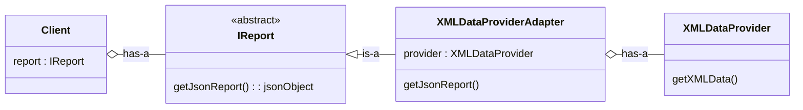
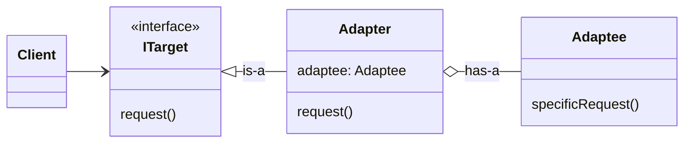
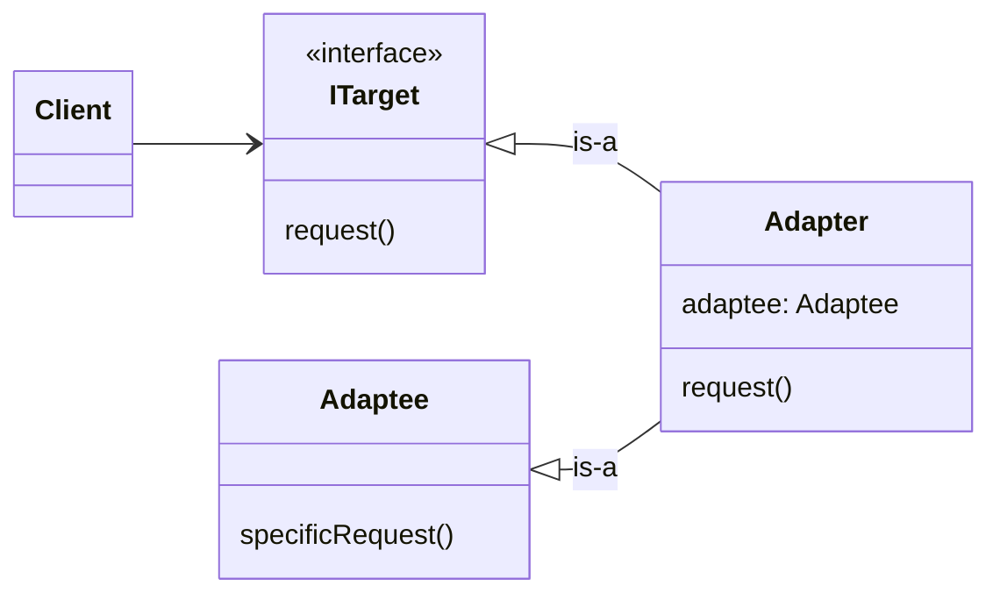

# Adapter Design Pattern

Just like the normal adapter like : usb to type c/b adapter, us electric socket to india electric socket adapter

Adapter pattern also work same - convert one interface to another 

**Definition**: Adapter convert the interface of class into another interface that client expect. Adpder lets class work together that couldn't otherwise of incompatiable interface.



```cpp
#include <bits/stdc++.h>
using namespace std;

// Target Interface expected by the client
class IReport{
    public:
        virtual string getJsonData(const string& data) = 0;
        virtual ~IReport() {}
};

// Adaptee : Provide XML Data from raw data
class XMLDataProvider{
    public:
        // Data format : name:id -> e.g Saddy:92
        string getXmlData(const string& data){
            size_t sep = data.find(':');
            string name = data.substr(0, sep);
            string id = data.substr(sep+1);
            
            return "<user>"
                "<name>" + name + "</name>"
                "<id>" + id + "</id>"
                "</user>";
        }
};

// Adapter : convert xml to json
class XMLDataProviderAdapter : public IReport{
    private:
        XMLDataProvider* xmlProvider;
    public:
        XMLDataProviderAdapter(XMLDataProvider* provider) : xmlProvider(provider) {}
        
        string getJsonData(const string& data) override{
            string xml = xmlProvider->getXmlData(data);
            
            size_t startName = xml.find("<name>")+6;
            size_t endName = xml.find("</name>");
            string name = xml.substr(startName, endName - startName);
            
            size_t startId = xml.find("<id>")+4;
            size_t endId = xml.find("</id>");
            string id = xml.substr(startId, endId - startId);
            
            return "{\"name\":\""+name+"\",\"id\":"+id+"}";
        }
};

class Client{
    public:
        void getReport(IReport* report, string rawData){
            cout<<report->getJsonData(rawData)<<endl;
        }
};

int main() {
    XMLDataProvider* xmlProvider = new XMLDataProvider();
    
    IReport* adapter = new XMLDataProviderAdapter(xmlProvider);
    
    string rawData = "Saddy:143";
    
    Client* client = new Client();
    client->getReport(adapter, rawData);
    
    delete xmlProvider;
    delete adapter;
    delete client;
    
    return 0;
}
```

## Standar UML Diagram
### Object Adapter (use composition)


### Class Adapter (use inheritance)
use multiple inheritance

but as we discussed we will prefer composition over inheritance

override target->request() and implement adaptee->specificRequest()

## Real Worl Use Case
- Integration of 3rd Pary Vendor 
- Working with Legacy code (Moder code -- Adapter -- Legacy Code)


## Conclusions
### One line answer: 
Use Adapter Pattern when you want to make existing or third-party code work with your system without changing its interface

### Strong Design Smell
| Smell                       | Meaning              |
| --------------------------- | -------------------- |
| Wrapper methods everywhere  | Need adapter         |
| Manual data conversion      | Adapter missing      |
| Client depends on 3rd party | Tight coupling       |
| Interface mismatch          | Classic adapter case |

### When NOT to Use Adapter
- When you can directly change the code
- When interface already matches
- Overusing adapters → complexity
- Performance-critical hot paths (careful)

## Problem It Solves
- Client depends on interface **A**
- Existing / third-party / legacy class provides interface **B**
- Neither interface can or should be changed
- Direct interaction is impossible due to mismatch

Adapter bridges this mismatch safely.

### Roles
- **Target**: Interface expected by the client
- **Adaptee**: Existing class with incompatible interface
- **Adapter**: Translates Target calls into Adaptee calls

### Adapter CAN
- Translate method names
- Convert input/output data formats
- Hide third-party SDK complexity
- Isolate external API changes

### Adapter CANNOT
- Add new business behavior
- Modify domain logic
- Choose between algorithms
- Simplify multiple subsystems (Facade does that)

### When to Use
- Integrating third-party or legacy code
- Client and service interfaces do not match
- You want to protect core domain from external changes
- Refactoring existing code is risky or impossible

### When NOT to Use
- Interfaces already match
- You own and can change both sides
- Behavior variation is needed (use Strategy)
- Functionality needs to be enhanced (use Decorator)