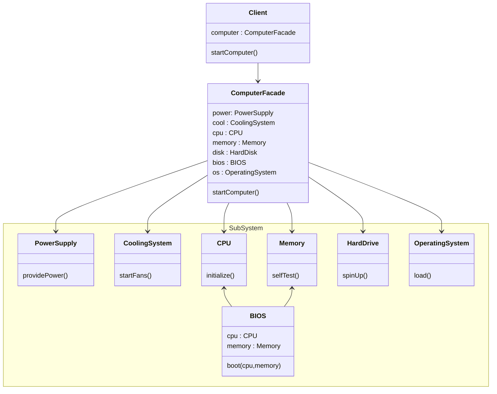
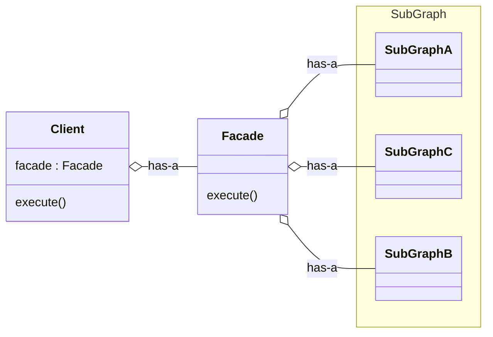

# Facade Design Pattern

If client want to talk to sub-system which have multiple component and complex relation between them, client don't directly talk with sub-system instead client call facade class and facade calss will do that for client.

**Definition**: Facade pattern provides a simplified, unified interface to a set of complex subsystem.
It hides the complexity of the system and expose only what is needed.

**Computer Starting Example**


```cpp
void startComputer(){
    comp->startComputer();
}
```

## Standard UML Diagram

Client don't know what is happening in the sub-system, it just call the execute of facade

### Code
```cpp
#include <iostream>
using namespace std;

// Sub System
class PowerSupply {
public:
    void providePower() {
        cout << "Power Supply: Providing power..." << endl;
    }
};

class CoolingSystem {
public:
    void startFans() {
        cout << "Cooling System: Fans started..." << endl;
    }
};

class CPU {
public:
    void initialize() {
        cout << "CPU Initialization Started..." << endl;
    }
};

class Memory {
public:
    void selfTest() {
        cout << "Memory: Self-test completed..." << endl;
    }
};

class HardDrive {
public:
    void spinUp() {
        cout << "Hard Drive: Spinning up..." << endl;
    }
};

class OperatingSystem {
public:
    void load() {
        cout << "Operating System: Loading..." << endl;
    }
};

class BIOS {
public:
    void boot(CPU& cpu, Memory& memory) {
        cout << "BIOS: Booting system..." << endl;
        cpu.initialize();
        memory.selfTest();
    }
};

// Facade
class ComputerFacade {
private:
    PowerSupply powerSupply;
    CoolingSystem coolingSystem;
    CPU cpu;
    Memory memory;
    HardDrive hardDrive;
    BIOS bios;
    OperatingSystem os;

public:
    void startComputer() {
        cout << "----- Starting Computer -----" << endl;
        powerSupply.providePower();
        coolingSystem.startFans();
        bios.boot(cpu, memory);
        hardDrive.spinUp();
        os.load();
        cout << "Computer Booted Successfully!" << endl;
    }
};

// Client
int main() {
    ComputerFacade computer;
    computer.startComputer();
    return 0;
}
```

## Real Life Use Case
- Gaming Engine (Unity)
    - Game Start : memory management, game asset, physics engine
- PaymentGateway 
    - makePayment() : check pin, check balance, notification, fraud transaction, etc

## Conclusions

### One-line answer
Use **Facade Pattern** when you want to provide a **single, simple entry point** to a **complex subsystem** and **protect clients from subsystem complexity and change**.

---

### Strong Design Smells (Facade Missing)

| Smell                                | Meaning                                      |
|-------------------------------------|----------------------------------------------|
| Client talks to many subsystems      | No unified entry point                       |
| Controller calls 5–6 services        | Orchestration leaking to client              |
| Duplicate workflow logic in clients  | Coordination logic scattered                 |
| Client breaks on subsystem change    | No protection layer                          |
| Hard-to-follow call sequence         | Subsystem complexity exposed                 |

---

### When NOT to Use Facade
- When the subsystem is already simple
- When clients need full control over subsystem APIs
- When business logic is hidden inside the Facade
- When Facade becomes a God Object / Service Layer
- When behavior variation is required (use Strategy / Command)

---

## Problem It Solves
- Client must interact with multiple services or classes
- Subsystem has complex coordination and call ordering
- Client becomes tightly coupled to subsystem internals
- Subsystem changes ripple into client code

Facade restructures **access**, not **behavior**.

---

## Roles
- **Client**: Uses the Facade
- **Facade**: Exposes high-level operations
- **Subsystem Classes**: Perform actual work (unchanged)

> Subsystems are unaware of the Facade.

---

## Facade CAN
- Orchestrate calls across multiple services
- Enforce correct call sequences
- Hide subsystem complexity
- Reduce client–subsystem coupling
- Provide a stable API over volatile subsystems

---

## Facade CANNOT
- Add new business or domain rules
- Replace domain services
- Decide business policies
- Encapsulate algorithms
- Translate interfaces (Adapter does that)

---

## When to Use
- Complex workflows involving many subsystems
- Controllers becoming bloated
- Need to protect clients from change
- Want a stable, simple API over complex internals
- Simplifying usage without reducing capability

---

## When NOT to Use
- Single-service interaction
- Facade contains business decisions
- Facade duplicates service-layer logic
- Runtime behavior variation is required (Decorator / Strategy)
- Interface mismatch exists (use Adapter)

---

## Facade vs Others (Quick Mental Map)
- **Facade** → Simplifies usage
- **Adapter** → Fixes interface mismatch
- **Decorator** → Adds behavior
- **Command** → Encapsulates requests
- **Mediator** → Coordinates peer interactions

---

## Red Flag
If your Facade starts making **business decisions**,  
it is no longer a Facade — it has become a **Service Layer or God Object**.
