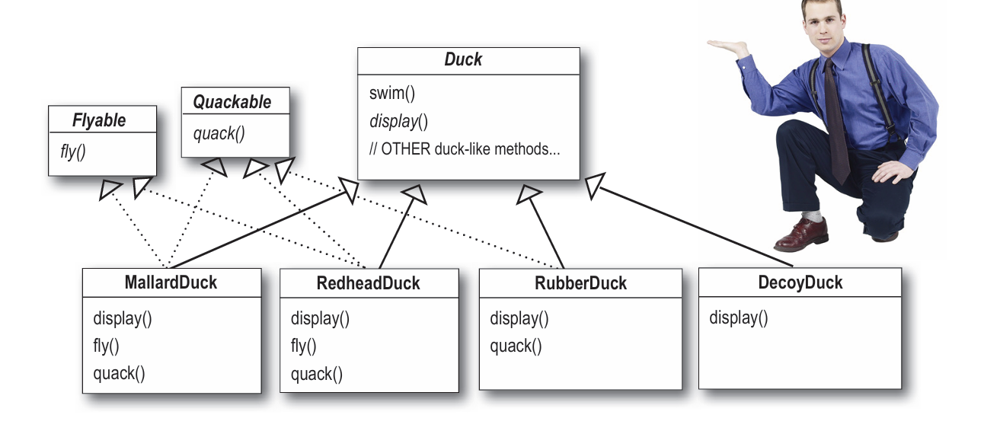
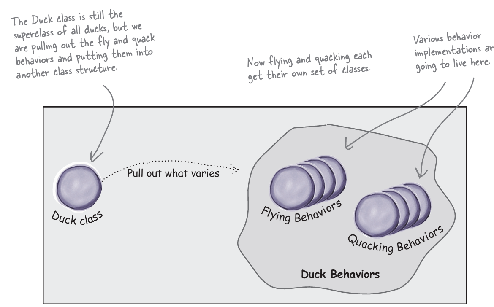
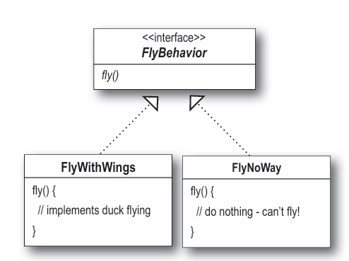
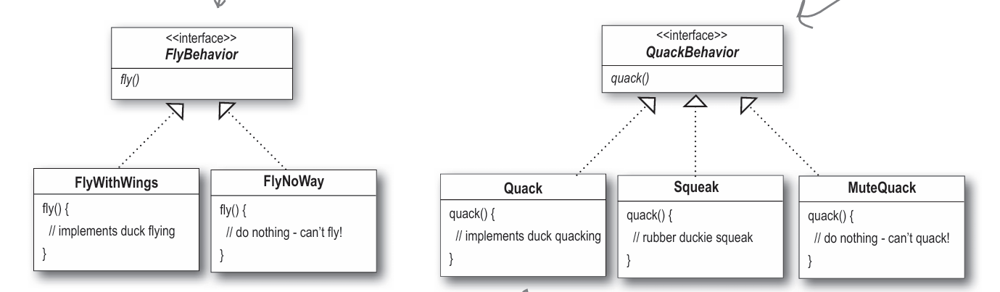
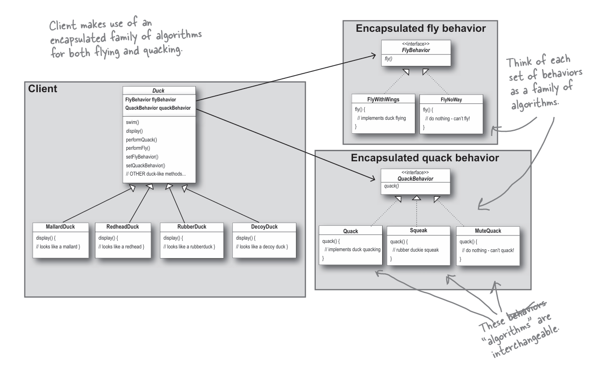
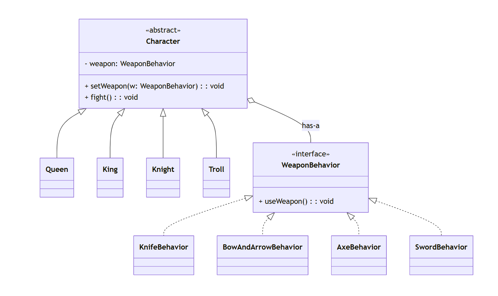

# 1. The Strategy Pattern : 
defines a family of algorithms, 
encapsulates each one, and makes them interchangeable.  
Strategy lets the algorithm vary independently from 
clients that use it

```java
public interface Flyable {
    void fly();
}


public interface Quackable {
    void quack();
}


public abstract class Duck {

    public void swim() {
        System.out.println("All ducks float, even decoys!");
    }

    public abstract void display();
}


public class MallardDuck extends Duck implements Flyable, Quackable {

    public void display() {
        System.out.println("I'm a Mallard duck");
    }

    public void fly() {
        System.out.println("I'm flying");
    }

    public void quack() {
        System.out.println("Quack");
    }
}


public class RedheadDuck extends Duck implements Flyable, Quackable {

    public void display() {
        System.out.println("I'm a Redhead duck");
    }

    public void fly() {
        System.out.println("I'm flying");
    }

    public void quack() {
        System.out.println("Quack");
    }
}


public class RubberDuck extends Duck implements Quackable {

    public void display() {
        System.out.println("I'm a rubber duck");
    }

    public void quack() {
        System.out.println("Squeak");
    }
}


public class DecoyDuck extends Duck {

    public void display() {
        System.out.println("I'm a decoy duck");
    }
}


```


## Initial
- duck superclass with swim(), quack(), display

1. make fly
- duck : fly()  --> RubberDuck also flying (joke), it should not
- **solution** : override the fly() in RubberDuck to do nothing

2. some don't quack :  DecoyDuck (WoodenDuck)
- **soluiton** : override the quack() for this also to do nothing

3. stakeholder want to change every 6 month, means every time need to change fly(), quack()

- **cameup** : flyable, quackable interface with fly() and quack() method respectively
- **problem** : if little change to fly() behaviour then need to make chnage in all the subclass having fly() method, bad idea


## Solution
- not all subclass should have the quack(), fly() so inheritance is not the right answer

**Note** : take the parts 
that vary and encapsulate them, so that later you can 
alter or extend the parts that vary without affecting 
those that don’t.  



**here** we will make duck class with not varing behaviour, and for varing behaviour we will create different interface for respective varing behaviour






### Interface vs Abstract class


### Code

```java
import java.util.*;
import java.lang.*;
import java.io.*;

// Here we create QuackBehavior, FlyBehavior variable but don't initialize

abstract class Duck{
    FlyBehavior flyBehavior;
    QuackBehavior quackBehavior;
    
    public abstract void display();
    
    public void performFly() {
        flyBehavior.fly();   // fixed
    }
    
    public void performQuack(){
        quackBehavior.quack();
    }
    
    public void swim() {
      System.out.println("All ducks float, even decoys!");
    }
    
    // **************** Setting Behaviour Dynamically *********************
    public void setFlyBehavior(FlyBehavior fb){
        flyBehavior = fb; 
    }
    
    public void setQuackBehavior(QuackBehavior qb){
        quackBehavior = qb;
    }
}


 interface FlyBehavior{
    public void fly();
}

 class FlyWithWings implements FlyBehavior{
    public void fly(){
        System.out.println("I'm flying!!");
    }
}

 class FlyNoWay implements FlyBehavior{
    public void fly() {
       System.out.println("I can't fly");
    }
}

class FlyRocketPowered implements FlyBehavior{
    public void fly(){
        System.out.println("I'm flying with a rocket!");
    }
}


 interface QuackBehavior{
    public void quack();
}

 class Quack implements QuackBehavior{
    public void quack() {
      System.out.println("Quack");
   }
}

 class MuteQuack implements QuackBehavior{
    public void quack() {
        System.out.println("<< Silence >>");
   }
}

 class Squeak implements QuackBehavior{
    public void quack() {
        System.out.println("Squeak");
   }
}

// Here we initialize the flyBehavior, quackBehavior so that MallardDuck class can use it
// By this way only the class need 

class MallardDuck extends Duck {

    public MallardDuck() {
        flyBehavior = new FlyWithWings();
        quackBehavior = new Quack();
    }

    public void display() {
        System.out.println("I'm a real Mallard duck");
    }
}


class ModelDuck extends Duck{
    public ModelDuck(){
        flyBehavior = new FlyNoWay();
        quackBehavior = new Quack();
    }
    
    public void display() {
       System.out.println("I'm a model duck");
    }
}

class Codechef
{
	public static void main (String[] args) throws java.lang.Exception
	{
		// your code goes here
        Duck mallard = new MallardDuck();
        mallard.performQuack();
        mallard.performFly();
        
        
        Duck model = new ModelDuck();
        model.performFly();
        // We can change the flybehavior dynamically at runtime, which was not posssible if we put the implementation in Duck Class
        model.setFlyBehavior(new FlyRocketPowered());
        model.performFly();
	}
}
```




#### Chapter Task
