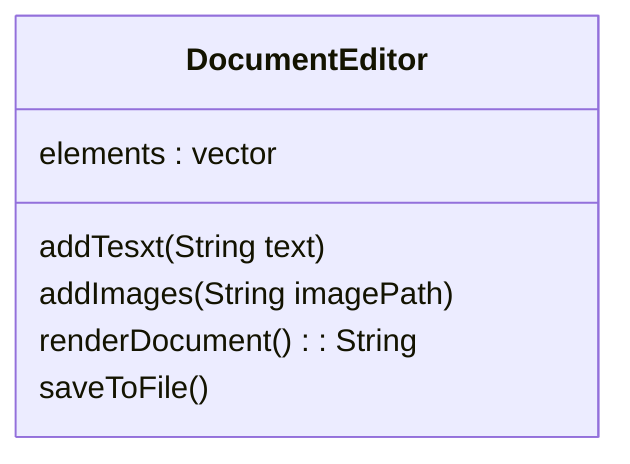
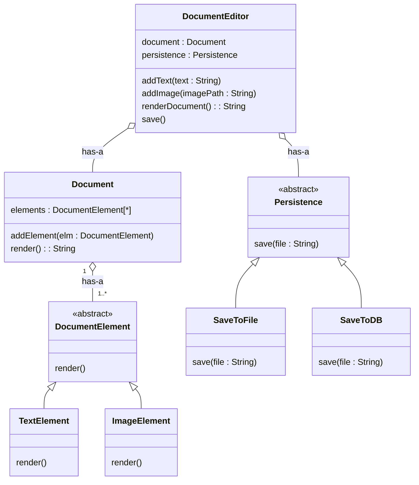
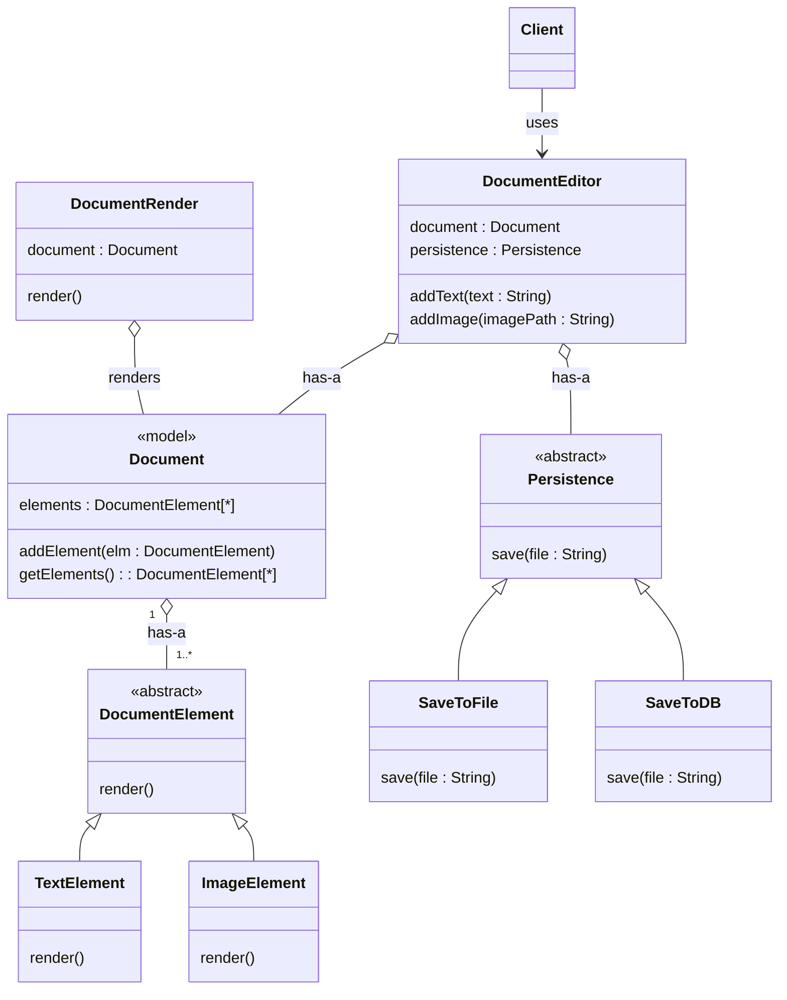

# Document Editor

- For now it supports : Text, Images
- Scalable : To support -- Video, Fonts, New Line , tab space, Tables

## Bad Design
- We will store Text, Image (path) in elements list and render the image when needed

**code** : [C++ Code of Naive Document Editor](editor.cpp)

### Problem in this design
- Break SRP : all features `addText`, `addImage`, `renderDocument` and `saveToFile` in same class
- Break Open-Close Principle : if we want to add more features we will need to open and make changes to DocumentEditor class

## Good Design (Minimal)
- take out elements from main class

**code** : [C++ code of Document Editor Follow SOLID Principle](DocumentEditor.cpp)

### Conclusion
- follow SRP
- follow Open Close Principle
- follow Liskov Substitution Principle
- follow Interface Segregation Principle
- follow Dipendency Inversion Principle
    - Document --> DocumentElement --> TextElement/ImageElement 
    - DocumentEditor --> Persistence --> FileStorage / DBStorage

### Problem with this design
- here it break as well as follow the SRP (it depends on you)
- if we say it break
- if we reomve render() then `DocumentEditor` have to remove render() from it, also if we remove save() then also 
- so we will create different class to handle only the render and one for handle the save rather than putting it in `DocumentEditor` or `Document` class

## Better Design
- Document -> model class
- new Render class

