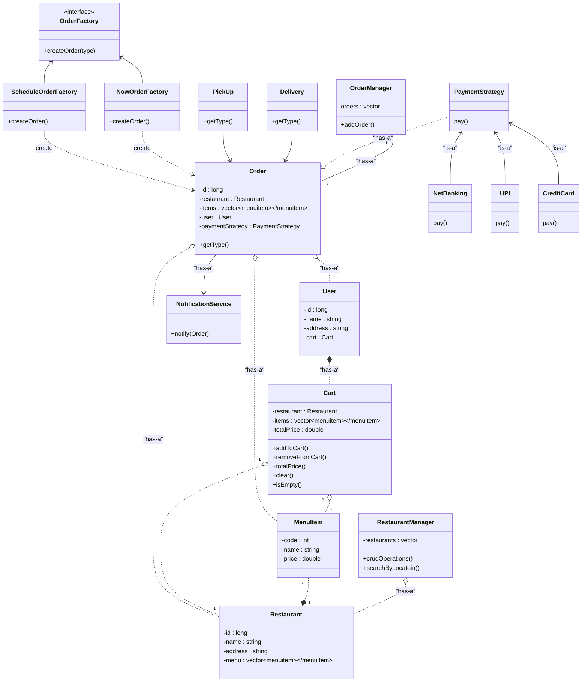
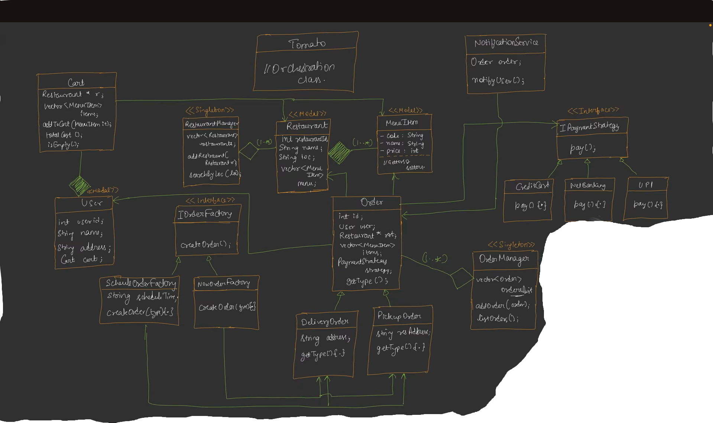

# Food Delivery

## Functional Requirements
- User can serach for restaurants based on location
- user can add items to cart
- user can checkout by making payment
- user should be notified once order i splaced successfully

## Non Functional Requirement
- Each part of design should be scalable and modifiable

## Happy Flow
- User Login to App
- List of Restaurants will be visible to user
- User select one restaurant
- Menu of that Restaurant will be visible to user
- User Place Items to Cart
- Do Payment
- Notificaiton will be sent to user for successful order

**Note** : Ask Interviewer:

Type of Order : `Delivery` only or `PickUp` also

Actor: Only `User` Centric or `Delivery Agent` also, i.e Functionality for user to place order or agent to know which restaurant order is where to deliver, etc

## UML Designing
- First lets start with Restaurant creation, what restaurant will have : `id`, `name`, `address`, `Menu`
- Menu will have MenuItem which will be object it self, so lets make that first
- MenuItem: `code`, `name`, `price` this will be model class
- Restaurant 'has-a' Menu (1 to many) , MenuItem is not independent to Restaurant (for this question but it can be) so it is strict composition relationship
- RestaurantManager : perform CRUD on Restaurant and search List of Restaurant based on Locaiton
- RestaurantManager has a Restaurant but Restaurant can live without RestaurantManager 
- Cart has Restaurant (1) and MenuItem (many)
- User have Cart and cart is dependent on User : string composition relationship

- We will use Strategy design pattern for Payment
- after successful payment order will be created

- Single point of contact to manage Order : OrderManager - create, saveToDB, etc

- **Modal Classes** : `Restaurant`, `MenuItem`, `User`
- **Singleton** : `RestaurantManager` , `OrderManager`

## Extra
- **Model Class** : Simple class that have only attributes and Getter Setter, no functionality

- **Mangers** are Singleton Class