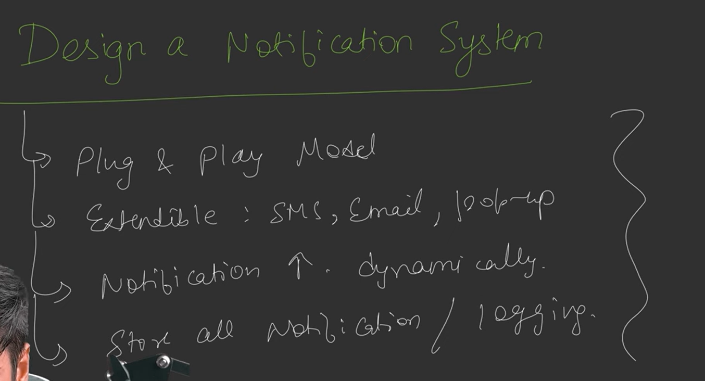
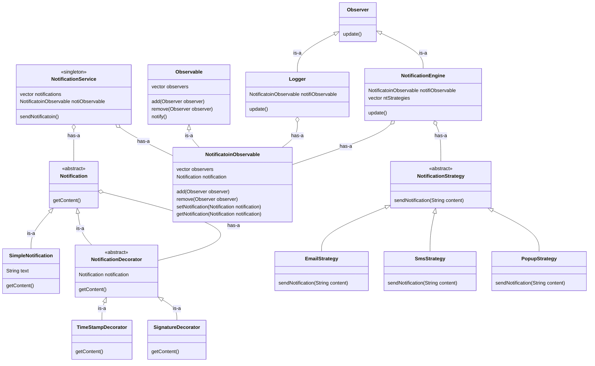

# Notification Engine

## Funcitonal and Non Functional Requirement

## Start UML 
- Notification (abstract) class - child : Simple Notification (getContext(), sms)
- use Decorator to Decorate Notification dynamically
- Concrete Decorator : signatureDecorator, TimeStampDecorator
- Notification Service will send notificaiton to observable
- Observable : vector<Observer> , add(), remove(), notify
- ConcreteObservable : getNotification(), setNotification(), INotification
- Observer : update()
- ConcreteObserver : Logger, NotificationEngine (1-many with notificationstrategy)
- NotificationStrategy 
- NotificationService : singleton class because we don't need multiple history

## UML
