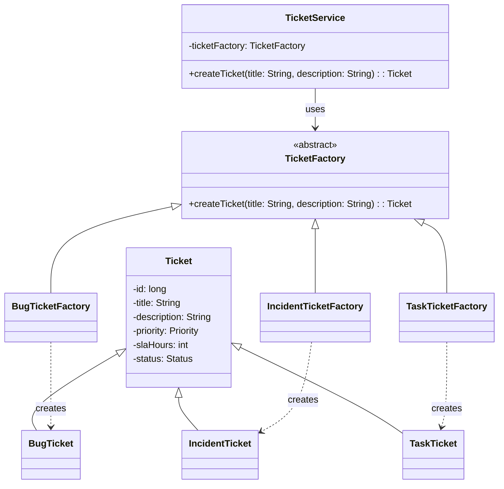
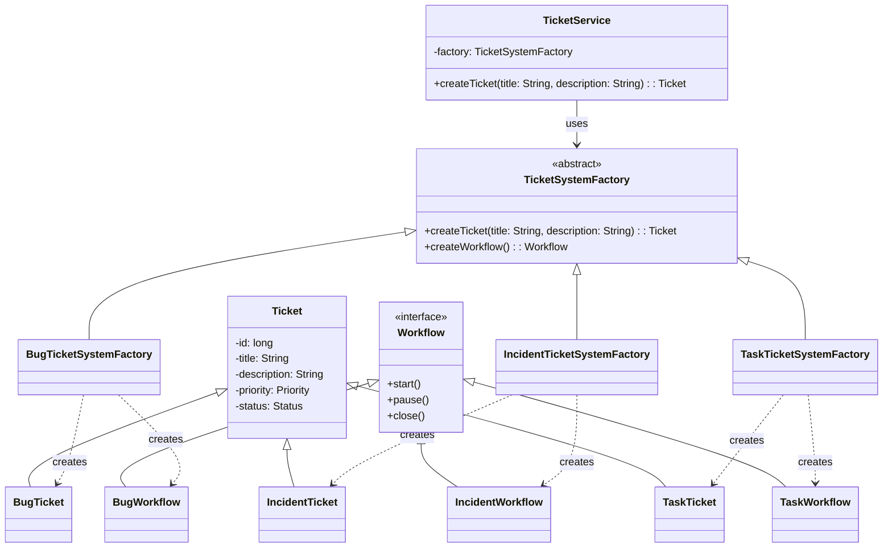

## UML : Factory Method

```mermaid
classDiagram

%% =========================
%% Domain Layer
%% =========================
class Ticket {
    -id: long
    -title: String
    -description: String
    -priority: Priority
    -slaHours: int
    -status: Status
}

class BugTicket
class IncidentTicket
class TaskTicket

Ticket <|-- BugTicket
Ticket <|-- IncidentTicket
Ticket <|-- TaskTicket


%% =========================
%% Factory Layer (Factory Method)
%% =========================
class TicketFactory {
    <<abstract>>
    +createTicket(title: String, description: String): Ticket
}

class BugTicketFactory
class IncidentTicketFactory
class TaskTicketFactory

TicketFactory <|-- BugTicketFactory
TicketFactory <|-- IncidentTicketFactory
TicketFactory <|-- TaskTicketFactory

BugTicketFactory ..> BugTicket : creates
IncidentTicketFactory ..> IncidentTicket : creates
TaskTicketFactory ..> TaskTicket : creates


%% =========================
%% Service Layer
%% =========================
class TicketService {
    -ticketFactory: TicketFactory
    +createTicket(title: String, description: String): Ticket
}

TicketService --> TicketFactory : uses
```

## UML : Abstract Factory Mehtod

```mermaid
classDiagram

%% =========================
%% Product Family
%% =========================
class Ticket {
    -id: long
    -title: String
    -description: String
    -priority: Priority
    -status: Status
}

class Workflow {
    <<interface>>
    +start()
    +pause()
    +close()
}

%% =========================
%% Concrete Products – BUG
%% =========================
class BugTicket
class BugWorkflow

Ticket <|-- BugTicket
Workflow <|-- BugWorkflow

%% =========================
%% Concrete Products – INCIDENT
%% =========================
class IncidentTicket
class IncidentWorkflow

Ticket <|-- IncidentTicket
Workflow <|-- IncidentWorkflow

%% =========================
%% Concrete Products – TASK
%% =========================
class TaskTicket
class TaskWorkflow

Ticket <|-- TaskTicket
Workflow <|-- TaskWorkflow

%% =========================
%% Abstract Factory
%% =========================
class TicketSystemFactory {
    <<abstract>>
    +createTicket(title: String, description: String): Ticket
    +createWorkflow(): Workflow
}

%% =========================
%% Concrete Factories
%% =========================
class BugTicketSystemFactory
class IncidentTicketSystemFactory
class TaskTicketSystemFactory

TicketSystemFactory <|-- BugTicketSystemFactory
TicketSystemFactory <|-- IncidentTicketSystemFactory
TicketSystemFactory <|-- TaskTicketSystemFactory

BugTicketSystemFactory ..> BugTicket : creates
BugTicketSystemFactory ..> BugWorkflow : creates

IncidentTicketSystemFactory ..> IncidentTicket : creates
IncidentTicketSystemFactory ..> IncidentWorkflow : creates

TaskTicketSystemFactory ..> TaskTicket : creates
TaskTicketSystemFactory ..> TaskWorkflow : creates

%% =========================
%% Service Layer
%% =========================
class TicketService {
    -factory: TicketSystemFactory
    +createTicket(title: String, description: String): Ticket
}

TicketService --> TicketSystemFactory : uses
```