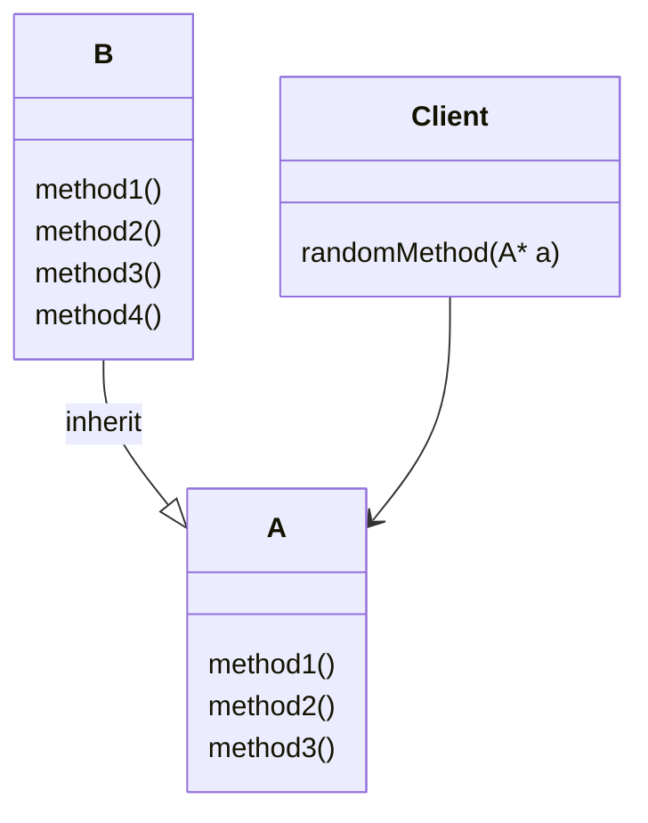
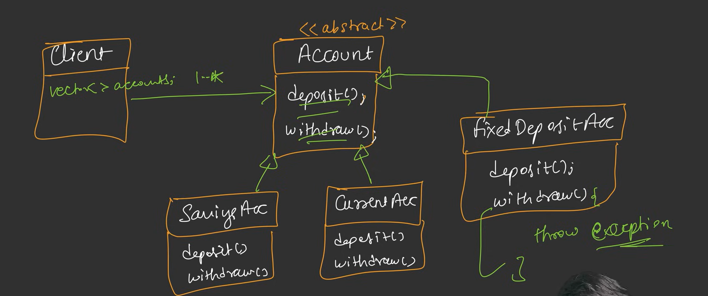
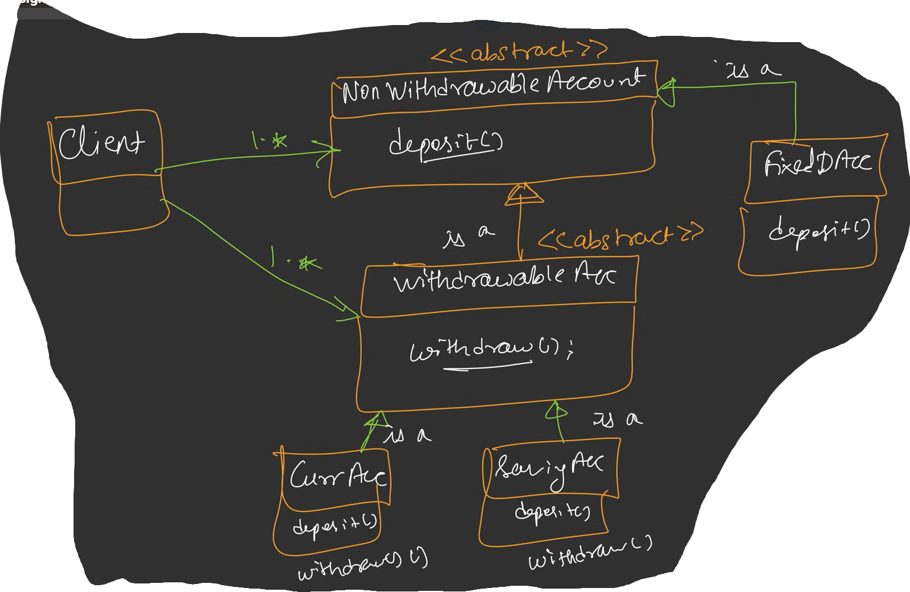
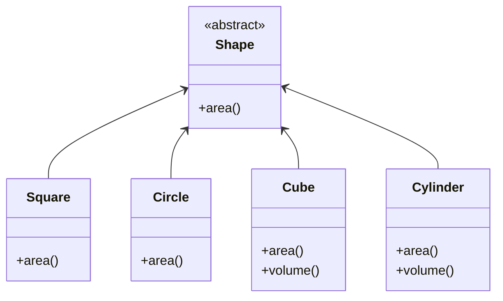
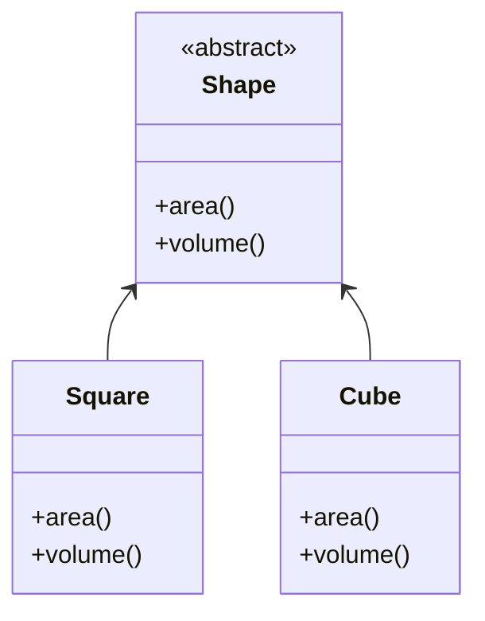
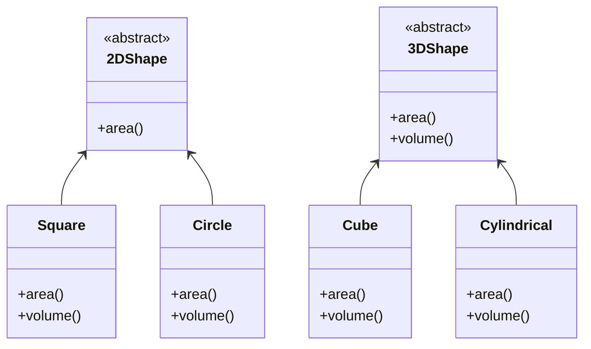

# Solid Principles

### Problem Arries when SOLID Principles not followed
- Maintability : If want to introduce new feature so it should be easily available to introduce without affecting the earlier code 
- Readebility : Easiy to read and understand
- BUGs 

1. **S –** Single Responsibility Principle

2. **O –** Open-Closed Principle

3. **L –** Liskov Substitution Principle

4. **I –** Interface Segregation Principle

5. **D –** Dependency Inversion Principle


## 1. Single Responsibility Principle
- A class should have only one reason to change.
- A Class should do only one thing.

- **Earlier**
    ```mermaid
    classDiagram
    class Product{
        price
        name
    }

    class ShoppingCart{
        calcTotalPrice()
        printInvoice()
        saveToDB()
    }

    ShoppingCart --> Product : "1..*"
    ```
    **Note** : This break the SRP, ShoppingCart should have only single responsibility, but here it has more than one responsibility. This will result : hard to make changes to any of the fucntionality in the class
    
    **Code: Voilating SRP (Single Responsibility Principle)**
    ```cpp
    #include<bits/stdc++.h>
    using namespace std;

    class Product{
        public:
            string name;
            double price;

        Product(string name, double price){
            this->name  = name;
            this->price = price;
        }
    };

    class ShoppingCart{
        private:
            vector<Product*> products;

        public:
            // setter
            void addProduct(Product *product){
                products.push_back(product);
            }

            // vector<Product*> getProducts(){}
            const vector<Product*>& getProducts(){
                return products;
            }

            // 1. Calculate Total Price
            double calcTotalPrice(){
                double totalPrice = 0;
                for(auto it: products){
                    totalPrice+= it->price;
                }
                return totalPrice;
            }

            // 2. Save Invoice
            void printInvoice(){
                cout<<"Shopping cart Invoice.."<<endl;
                for(auto p: products){
                    cout<<"Name: "<<p->name<<" ; Price: "<<p->price<<endl;
                }
                cout<<endl;
            }

            // 3. Save to DB
            void saveToDB(){
                cout<<"Saving shopping cart to Database...\n";
            }
    };

    int main(){
        ShoppingCart* cart = new ShoppingCart();

        cart->addProduct(new Product("IceCream Vanilla", 120.0));
        cart->addProduct(new Product("Dyson Hairdryer", 1320.50));

        cart->getProducts();
        cout<<"Total price: "<<cart->calcTotalPrice()<<endl;
        cart->saveToDB();

        return 0;
    }
    ```

- **Later**
    ```mermaid
    classDiagram
    class Product{
        price
        name
    }

    class ShoppingCart{
        calcTotalPrice()
    }

    class CartInvoicePrinter{
        ShoppingCart shoppingCart
        printInvoice()
    }

    class CartDBStorage{
        ShoppingCart shoppingCart
        saveToDB
    }

    ShoppingCart --> Product : "1..*"
    CartInvoicePrinter --> ShoppingCart : "has-a"
    CartDBStorage --> ShoppingCart : "has-a"
    ```

- **Final Code** : Follow SRP
    ```cpp
    #include<bits/stdc++.h>
    using namespace std;

    class Product{
        public:
            string name;
            double price;

        Product(string name, double price){
            this->name  = name;
            this->price = price;
        }
    };

    class ShoppingCart{
        private:
            vector<Product*> products;

        public:
            // setter
            void addProduct(Product *product){
                products.push_back(product);
            }

            // vector<Product*> getProducts(){}
            const vector<Product*>& getProducts(){
                return products;
            }

            // 1. Calculate Total Price
            double calcTotalPrice(){
                double totalPrice = 0;
                for(auto it: products){
                    totalPrice+= it->price;
                }
                return totalPrice;
            }
    };

    class CartInvoicePrinter{
        private:
            ShoppingCart *shoppingCart;

         public:
            CartInvoicePrinter(){
                shoppingCart = new ShoppingCart();
            }

            CartInvoicePrinter(ShoppingCart* cart){
                this->shoppingCart = cart;
            }

            void printInvoice(){
                cout<<"Shopping cart Invoice.."<<endl;
                for(auto p: shoppingCart->getProducts()){
                    cout<<"Name: "<<p->name<<" ; Price: "<<p->price<<endl;
                }
                cout<<endl;
            }
    };

    class CartDBStorage{
        private:
            ShoppingCart* shoppingCart;
        
        public:
            CartDBStorage(ShoppingCart* shoppingCart){
                this->shoppingCart = shoppingCart;
            }

            void saveToDB(){
                cout<<"Saving shopping cart to Database...\n";
            }
    }

    int main(){
        ShoppingCart* cart = new ShoppingCart();

        cart->addProduct(new Product("IceCream Vanilla", 120.0));
        cart->addProduct(new Product("Dyson Hairdryer", 1320.50));

        CartInvoicePrinter* printer = new CartInvoicePrinter(cart);
        printer->printInvoice();

        cart->getProducts();
        cout<<"Total price: "<<cart->calcTotalPrice()<<endl;

        CartDBStorage* cartDBStorage = new CartDBStorage(cart);
        cartDBStorage->saveToDB();


        return 0;
    }
    ```

**Note:** In SRP it does not mean that this class will have only one mehtod as this example, there could me more methods only there responsiblity should be one for entire class, rest method can be supportive methods for each other but overall funcionality of the class will be single responsibility

## 2. Open-Close Principle
- A class should be open for extension and closed for modification.
- To add new feature don't modify the old code

**Task** : Now we want to add more opitons to save To DB : like earlier it was using MySQL, now we also want MongoDB and File

- **Earlier**
    ```mermaid
    classDiagram
    class Product{
        price
        name
    }

    class ShoppingCart{
        calcTotalPrice()
    }

    class CartInvoicePrinter{
        ShoppingCart shoppingCart
        printInvoice()
    }

    class CartDBStorage{
        ShoppingCart shoppingCart
        saveToMySQL()
        saveToMongoDB()
        saveToFile()
    }

    ShoppingCart --> Product : "1..*"
    CartInvoicePrinter --> ShoppingCart : "has-a"
    CartDBStorage --> ShoppingCart : "has-a"
    ```
    **Note**: we added the method for different db storage in the same class, this follow SRP but failed for Open-Close Principle
    <br>
    We will use `Abstraction`, `Inheritance` and `Polymorphism` to achieve tihs principle

    **Code: Voilating Open Close Principle**
    ```cpp
    #include<bits/stdc++.h>
    using namespace std;

    class Product{
        public:
            string name;
            double price;

        Product(string name, double price){
            this->name  = name;
            this->price = price;
        }
    };

    class ShoppingCart{
        private:
            vector<Product*> products;

        public:
            // setter
            void addProduct(Product *product){
                products.push_back(product);
            }

            // vector<Product*> getProducts(){}
            const vector<Product*>& getProducts(){
                return products;
            }

            // 1. Calculate Total Price
            double calcTotalPrice(){
                double totalPrice = 0;
                for(auto it: products){
                    totalPrice+= it->price;
                }
                return totalPrice;
            }
    };

    class CartInvoicePrinter{
        private:
            ShoppingCart *shoppingCart;

         public:
            CartInvoicePrinter(){
                shoppingCart = new ShoppingCart();
            }

            CartInvoicePrinter(ShoppingCart* cart){
                this->shoppingCart = cart;
            }

            void printInvoice(){
                cout<<"Shopping cart Invoice.."<<endl;
                for(auto p: shoppingCart->getProducts()){
                    cout<<"Name: "<<p->name<<" ; Price: "<<p->price<<endl;
                }
                cout<<endl;
            }
    };

    class CartDBStorage{
        private:
            ShoppingCart* shoppingCart;
        
        public:
            CartDBStorage(ShoppingCart* shoppingCart){
                this->shoppingCart = shoppingCart;
            }

            void Save2SQLDB(){
                cout<<"Saving shopping cart to SQL Database...\n";
            }
            
            void Save2MongoDB(){
                cout<<"Saving shopping cart to MongoDB Database...\n";
            }
            
            void Save2File(){
                cout<<"Saving shopping cart to File...\n";
            }   
    };

    int main(){
        ShoppingCart* cart = new ShoppingCart();

        cart->addProduct(new Product("IceCream Vanilla", 120.0));
        cart->addProduct(new Product("Dyson Hairdryer", 1320.50));

        CartInvoicePrinter* printer = new CartInvoicePrinter(cart);
        printer->printInvoice();

        cart->getProducts();
        cout<<"Total price: "<<cart->calcTotalPrice()<<endl;

        CartDBStorage* cartDBStorage = new CartDBStorage(cart);
        cartDBStorage->Save2MongoDB();


        return 0;
    }
    ```

- **Later**
<br>
here`CartDBStorage` is a hard (concrete class), first we will make it `abstract` / `interface` class.

    ```mermaid
    classDiagram
    class Product{
        price
        name
    }

    class ShoppingCart{
        calcTotalPrice()
    }

    class CartInvoicePrinter{
        ShoppingCart shoppingCart
        printInvoice()
    }

    class DBPersistence{
        <<abstract>>
        save()
    }

    class Save2SQLDB{
        save()
    }

    class Save2MongoDB{
        save()
    }

    class Save2File{
        save()
    }

    ShoppingCart --> Product : 1..*
    CartInvoicePrinter --> ShoppingCart : has-a
    DBPersistence --> ShoppingCart : has-a
    Save2SQLDB --|> DBPersistence
    Save2MongoDB --|> DBPersistence
    Save2File --|> DBPersistence
    ```

    **Final Code**
    ```cpp
    #include<bits/stdc++.h>
    using namespace std;

    class Product{
        public:
            string name;
            double price;

        Product(string name, double price){
            this->name  = name;
            this->price = price;
        }
    };

    class ShoppingCart{
        private:
            vector<Product*> products;

        public:
            // setter
            void addProduct(Product *product){
                products.push_back(product);
            }

            // vector<Product*> getProducts(){}
            const vector<Product*>& getProducts(){
                return products;
            }

            // 1. Calculate Total Price
            double calcTotalPrice(){
                double totalPrice = 0;
                for(auto it: products){
                    totalPrice+= it->price;
                }
                return totalPrice;
            }
    };

    class CartInvoicePrinter{
        private:
            ShoppingCart *shoppingCart;

         public:
            CartInvoicePrinter(){
                shoppingCart = new ShoppingCart();
            }

            CartInvoicePrinter(ShoppingCart* cart){
                this->shoppingCart = cart;
            }

            void printInvoice(){
                cout<<"Shopping cart Invoice.."<<endl;
                for(auto p: shoppingCart->getProducts()){
                    cout<<"Name: "<<p->name<<" ; Price: "<<p->price<<endl;
                }
                cout<<endl;
            }
    };
    
    class DBPersistence{
        private:
            ShoppingCart* shoppingCart;
            
        public:
            virtual void save(ShoppingCart* shoppingCart) = 0;
    };
    
    class Save2SQLDB : public DBPersistence{
        void save(ShoppingCart* shoppingCart) override {
            cout<<"Saving shopping cart to SQL Database...\n";
        }
    };
    
    class Save2MongoDB : public DBPersistence{
        void save(ShoppingCart* shoppingCart) override {
            cout<<"Saving shopping cart to MongoDB Database...\n";
        }
            
    };
    
    class Save2File : public DBPersistence{
        void save(ShoppingCart* shoppingCart) override {
            cout<<"Saving shopping cart to File...\n";
        } 
    };


    int main(){
        ShoppingCart* cart = new ShoppingCart();

        cart->addProduct(new Product("IceCream Vanilla", 120.0));
        cart->addProduct(new Product("Dyson Hairdryer", 1320.50));

        CartInvoicePrinter* printer = new CartInvoicePrinter(cart);
        printer->printInvoice();

        cart->getProducts();
        cout<<"Total price: "<<cart->calcTotalPrice()<<endl;

        DBPersistence* db = new Save2SQLDB();
        db->save(cart);
        
        DBPersistence* mongo = new Save2MongoDB();
        mongo->save(cart);
        
        DBPersistence* file = new Save2File();
        file->save(cart);


        return 0;
    }
    ```

## 3. Liskov Substitution Principle
- Subclass should be substitutable for there base classes.
- if we are using `A* a = new A()` and `a->method1()` so it should also work `A* a = new B()` and `a->method1()` if `class B : public A{}`, without any issue B should be substituted in place of A.


```cpp
// here both are same, as method1, method2 are already inherited from class A to class B
int main(){
    A * a = new A();
    a->method1();
    a->method2();

    A* a = new B();
    a->method1();
    a->method2();

    return 0;
}
```

```cpp
#include <bits/stdc++.h>
using namespace std;

class Account {
    public:
        virtual void deposit(double amount) = 0;
        virtual void withdraw(double amount) = 0;
};

class SavingAcc : public Account{
    private:
        double balance;
    
    public:
        SavingAcc(){
            balance = 0;
        }
        
        void deposit (double amount){
            balance+= amount;
            cout<<amount<<"Rs Deposited!"<<endl;
            cout<<"Current balance is : "<<balance<<endl;
        }
        
        void withdraw(double amount){
            if(amount>balance){
                cout<<"Insufficient Balance in the Account!!"<<endl;
            }else{
                balance-=amount;
                cout<<amount<<"RS Withdrawl!"<<endl;
                cout<<"Current balance is : "<<balance<<endl;
            }
        }
};

class CurrentAcc : public Account{
    private:
        double balance;
    
    public:
        CurrentAcc(){
            balance = 0;
        }
        
        void deposit (double amount){
            balance+= amount;
            cout<<amount<<"Rs Deposited!"<<endl;
            cout<<"Current balance is : "<<balance<<endl;
        }
        
        void withdraw(double amount){
            if(amount>balance){
                cout<<"Insufficient Balance in the Account!!"<<endl;
            }else{
                balance-=amount;
                cout<<amount<<"RS Withdrawl!"<<endl;
                cout<<"Current balance is : "<<balance<<endl;
            }
        }
};

class FixedDepositAcc : public Account{
    private:
        double balance;
    
    public:
        FixedDepositAcc(){
            balance = 0;
        }
        
        void deposit (double amount){
            balance+= amount;
            cout<<amount<<"Rs Deposited!"<<endl;
            cout<<"Current balance is : "<<balance<<endl;
        }
        
        void withdraw(double amount){
            throw logic_error("Withdrawl not allowed in fixed account type");
        }
};

class BankClient{
    private:
        vector<Account*> accounts;
    
    public:
        BankClient(vector<Account*> accounts){
            this->accounts = accounts;
        }
        
        void processTransaction(){
            for(auto acc: accounts){
                acc->deposit(1000);
                
                try{
                    acc->withdraw(500);
                }
                catch(const logic_error& e){
                    cout<<"Exception: "<<e.what()<<endl;
                }
            }
        }
};

int main() {
	// your code goes here
	
	vector<Account*> accounts;
	
	accounts.push_back(new CurrentAcc());
	accounts.push_back(new SavingAcc());
	accounts.push_back(new FixedDepositAcc());
	
	BankClient* bank = new BankClient(accounts);
	bank->processTransaction();
	
	return 0;

}
```

### Exmaple

**here** if we used the fixedDepositAcc then we can't use the withdraw() for betterment of account type. so this will break the Liskov Substitution Principle

#### Hit and Try
**Way 1**
if we use if-else
```cpp
if(acctype = fixed) deposit()
else{
    deposit();
    withdraw()
}
```
This seems good, but it is worst, as here account is now tightly copuled. Client will need information of interface implementation but we don't want this. 
**Also** : This will break Open-Close Principle


**Way 2: correct way**
As FixedAcc is narraw down the parent class, means it should not be the child of Account type

Now we have solve the problem, and now client will have two option, either want only deposit or both deposit and withdraw

```cpp
#include <bits/stdc++.h>
using namespace std;

class DepositOnlyAccount {
    public:
        virtual void deposit(double amount) = 0;
};

class WithdrawableAccount : public DepositOnlyAccount {
    public:
        virtual void withdraw(double amount) = 0;
};

class SavingAcc : public WithdrawableAccount{
    private:
        double balance;
    
    public:
        SavingAcc(){
            balance = 0;
        }
        
        void deposit (double amount){
            balance+= amount;
            cout<<amount<<"Rs Deposited!"<<endl;
            cout<<"Current balance is : "<<balance<<endl;
        }
        
        void withdraw(double amount){
            if(amount>balance){
                cout<<"Insufficient Balance in the Account!!"<<endl;
            }else{
                balance-=amount;
                cout<<amount<<"RS Withdrawl!"<<endl;
                cout<<"Current balance is : "<<balance<<endl;
            }
        }
};

class CurrentAcc : public WithdrawableAccount{
    private:
        double balance;
    
    public:
        CurrentAcc(){
            balance = 0;
        }
        
        void deposit (double amount){
            balance+= amount;
            cout<<amount<<"Rs Deposited!"<<endl;
            cout<<"Current balance is : "<<balance<<endl;
        }
        
        void withdraw(double amount){
            if(amount>balance){
                cout<<"Insufficient Balance in the Account!!"<<endl;
            }else{
                balance-=amount;
                cout<<amount<<"RS Withdrawl!"<<endl;
                cout<<"Current balance is : "<<balance<<endl;
            }
        }
};

class FixedDepositAcc : public DepositOnlyAccount{
    private:
        double balance;
    
    public:
        FixedDepositAcc(){
            balance = 0;
        }
        
        void deposit (double amount){
            balance+= amount;
            cout<<amount<<"Rs Deposited!"<<endl;
            cout<<"Current balance is : "<<balance<<endl;
        }
};

class BankClient{
    private:
        vector<DepositOnlyAccount*> depositOnlyAccount;
        vector<WithdrawableAccount*> withdrawableAccount;
    
    public:
        BankClient(vector<DepositOnlyAccount*> depositOnlyAccount,
        vector<WithdrawableAccount*> withdrawableAccount){
            this->depositOnlyAccount = depositOnlyAccount;
            this->withdrawableAccount = withdrawableAccount;
        }
        
        void processTransaction(){
            for(auto acc: depositOnlyAccount){
                acc->deposit(1000);
            }
            
            for(auto acc: withdrawableAccount){
                acc->deposit(1000);
                acc->withdraw(500);
            }
        }
};

int main() {
	// your code goes here
	
	vector<DepositOnlyAccount*> depositOnlyAccount;
    vector<WithdrawableAccount*> withdrawableAccount;
	
	withdrawableAccount.push_back(new CurrentAcc());
	withdrawableAccount.push_back(new SavingAcc());
	depositOnlyAccount.push_back(new FixedDepositAcc());
	
	BankClient* bank = new BankClient(depositOnlyAccount, withdrawableAccount);
	bank->processTransaction();
	
	return 0;

}
```
### Guidelines to prevent breaking of Liskov Substitution principle
**Broad**: Parent Class, **Narrow**: Child class
#### 1) Signature Rule: 
##### a) Method Argument Rule
**Fail**
```cpp
class Parent {
    public:
        virtual void print(string msg){
            cout<<"Message: "<<msg<<endl;
        }
};

class Child : public Parent {
    public:
        void print(int num){
            cout<<"Number : "<<num<<endl;
        }
};
```
**Pass**
```cpp
class Parent {
    public:
        virtual void print(string msg){
            cout<<"Message: "<<msg<<endl;
        }
};

class Child : public Parent {
    public:
        void print(String num){
            cout<<"Number : "<<num<<endl;
        }
};
```

##### b) Return Type Rule
Return Type can be either of same class or can be or narrow (child class), but can't be vise versa;
```cpp
class Animal{};
class Dog : public Animal{};

class Parent {
    public:
        Animal print(string msg){
            return new Animal();
        }
};

class Child1 : public Parent {
    public:
        Animal print(String num){
            return new Animal();
        }
};

class Child2 : public Parent {
    public:
        Dog print(String num){
            return new Dog();
        }
};

class Client{
    public:
        Parent* c1 = new Child1();
        Parent* c2 = new Child2();

        Animal animal1 = c1->print();
        Animal animal2 = c2->print();
}
```
**here** : Client expecting return type to be Animal but child2 return type is Dog, it will also work as Dog is narrow class. but can't be the vise versa
Example: `Dog dog1 = p1->print();`

##### c) Exception Rule
Child should throw either same class error or narrow class error but can't be vise versa
<br>
*************** **Follow Liskov Substitution Principle** ***************
```cpp
class Parent {
    public:
        void random(string msg){
            try{}
            catch(Logical_error e){}
        }
};

class Child1 : public Parent {
    public:
        void random(String num){
            try{}
            catch(Logical_error e){}
        }
};

class Child2 : public Parent {
    public:
        void random(String num){
            try{}
            catch(Out_of_range e){}
        }
};
```
**here**: Child1 throw same error, while Child2 throw narrow class error which is also acceptable.
<br>
*************** **Break Liskov Substitution Principle** ***************
```cpp
class Parent {
    public:
        void random(string msg){
            try{}
            catch(Out_of_range e){}
        }
};

class Child : public Parent {
    public:
        void random(String num){
            try{}
            catch(Logical_error e){}
        }
};
```
**here** : Child throw broader class error which is not acceptable, code will work but it will break the Liskov Substitution Principle.

#### 2) Property Rule:
##### a) Class Invariant
- Invariant: Rules
```cpp
// Invariant: Balance can't be negative
class Account{
    private: 
        int balance;
    public:
        Account(int balance b){
            if(b<0) throw invalid_argument("Balance can't be negative");
            else this->balance = b;
        }

        virtual void withdraw(int amt){
            if(balance - amt < 0) throw runtime_error("Insufficient balance");
            else balance-=amt;
        }
}

class CheatAccount : public Account{
    CheatAccount(int b) : Account(b){}

    void withdraw(int amt){
        balance -= amt; // LSP Break! : Negative balance allowed
    }
}
```
**here** : Account class have invariant that balance can't be negative, but in its Subclass: CheatAccount it does not follow that invariant

##### b) History Constraint
```cpp
class Account{
    private: 
        int balance;
    public:
        Account(int balance b){
            if(b<0) throw invalid_argument("Balance can't be negative");
            else this->balance = b;
        }

        // History Constraint: Withdraw should be allowed!
        virtual void withdraw(int amt){
            if(balance - amt < 0) throw runtime_error("Insufficient balance");
            else balance-=amt;
        }
}

class FixedDepositAcc : public Account{
    CheatAccount(int b) : Account(b){}

    // LSP Break!
    // Parent class Behavior change: Now Withdraw is not allowed
    // This class will break client code that relies on withdraw
    void withdraw(int amt){
        throw runtime_error("Withdraw not allowed on fixed deposit account!");
    }
}

int main(){
    FixedDepositAcc* fd = new FixedDepositAcc(100);
    fd->withdraw(50);   // LSP Break
}
```


#### 3) Method Rule:
##### a) PreCondition
Subclass can have weaker precondition but not vice versa
```cpp
// PreCondition must be satisfied before the method can be excecuted.
// Subclass can weaken the precondition but cannot strengthen it.

class user{
    public:
        // PreCondition : Password should be atleast 8 character long
        void createPassword(string password){
            if(password.length()<8){
                throw invalid_argument("Password should be atleast 8 character long.");
            }
            cout<<"Password Created Successfully"<<endl;
        }
}

class AdminUser : public User{
    public:
        // PreCondition : Password should be atleast 6 character long
        void createPassword(string password){
            if(password.length()<6){
                throw invalid_argument("Password should be atleast 8 character long.");
            }
            cout<<"Password Created Successfully"<<endl;
        }
}

int main(){
    User* client = new AdminUser();
    client->createPassword("Admin1");   // Work fine, AdminUser allow shorter password
}
```
##### b) PostCondition
```cpp
// PostCondition must be satisfied after a method is excecuted.
// Subclass can strengthen the PostCondition but cannot weaken it.

class Car{
    private:
        int speed;

    public:
        Car(){
            speed = 0;
        }

        // PostCondition : Speed should be decreased after brake
        void brake(string password){
            brake-=20;
        }
}

class HybridCar : public Car{
    private:
        int charge;
    public:
        AdminUser() : Car(){
            charge = 0;
        }

        // PostCondition : Speed should be decreased after brake
        // PostCondition: Charge must increase
        void brake(string password){
            speed-=20;
            charge+=2;
        }
}

int main(){
    User* car = new HybridCar();
    client->brake("Admin1");   // Work fine, AdminUser allow shorter password
}
```


## 4. Interface Segregation Principle
- Many Client Specific Interface is better than one general purpose interface
- Client should not be forced to implement methods that they don't need
- Example
    - `Shape` : area()
    - `Square` : area()
    - `Circle` : area()
    - Now we want to introduce 3D object, that have volume as well
        - `Cube` : area() (come from inheritance) , volume() (this we have to mention specific in all 3D - violate DRY)
    - Other opiton: Put volume() in `Shape` -> this will make volume() in all subclass those don't need this --> again problem


**here** : volume() method is mention in each 3D object class, but this way need to make changes to all class if any change there in volume()
<br>
We want to add Volumne() in 3D object


**here** : Volume() is there in 2D object class also which is not needed there

**Correct Way**


### Problem with this Case
```cpp
#include <bits/stdc++.h>
using namespace std;

class Shape{
    public:
        virtual double area() = 0;
        virtual double volume() = 0;
};

// 2D Shpae (Square) : Forced to have volume()
class Square : public Shape{
    private:        
        double side;
    
    public:
        Square(double s) side(s) {}
        
        double area() override{
            return side*side;
        }
        
        double volume() override{   // Unnecessary Method
            throw logic_error("Volume not applicable for Square.");
        }
};

// Cube - 3D Shape : have both area() and volume()
class Cube : public Shape{
    private:
        double side;
    
    public:
        Cube(double s) side(s) {}
        
        double area() override{
            return side*side;
        }
        
        double volume() override{
            return side*side*side;
        }
};
```

### Solution of this Problem
```cpp
#include <bits/stdc++.h>
using namespace std;

class TwoDimensionShpae{
    public:
        virtual double area() = 0;
};

class ThreeDimensionShpae{
    public:
        virtual double area() = 0;
        virtual double volume() = 0;
};

// Implement 2D Shape , have only area()
class Square : public TwoDimensionShpae{
    private:        
        double side;
    
    public:
        Square(double s) : side(s) {}
        
        double area() override{
            return side*side;
        }
};

// Implement 3D shape , have both area() and volumne()
class Cube : public ThreeDimensionShpae{
    private:
        double side;
    
    public:
        Cube(double s) : side(s) {}
        
        double area() override{
            return side*side;
        }
        
        double volume() override{
            return side*side*side;
        }
};

int main() {
	// your code goes here
	TwoDimensionShpae* sq = new Square(2.0);
	ThreeDimensionShpae* cub = new Cube(2.0);
	
	cout<<"Area of Square : "<<sq->area()<<endl;
	cout<<"Area of Cube : "<<cub->area()<<endl;
	cout<<"Volume of Cube : "<<cub->volume()<<endl;
	
	return 0;
}
```

## 5. Dependency Inversion Principle
- High level Module should not depend on Low level Module but rather both should depend on abstraction.

### Example : Have Problem
```cpp
#include <bits/stdc++.h>
using namespace std;

class MongoDB{  // Low Level Module
    public:
        void save(){
            cout<<"Saved to MongoDB Successfully"<<endl;
        }
};

class MySQL{    // Low Level Module
    public:
        void save(){
            cout<<"Saved to MySQL Successfully"<<endl;
        }
};

class Application{  // High Level Module (Tightly Coupled)
    private:
        MongoDB* md;
        MySQL* sql;
    
    public:
        Application(MongoDB* md, MySQL* sql){
            this->md = md;
            this->sql = sql;
        }
        
        void saveToMongo(){
            md->save();
        }
        
        void saveToMySQL(){
            sql->save();
        }
};

int main() {
	// your code goes here
	MongoDB* md = new MongoDB();
	MySQL* sql = new MySQL();
	
	Application* app = new Application(md, sql);
	
	app->saveToMongo();
	app->saveToMySQL();
	
	delete md;
	delete sql;
	delete app;
	
	return 0;
}
```
**here** : When we need to use CasandraDB instead of MongoDB then we will have to make change to application code, this **breaks** Open-Closed Principle.

### Exmaple: Solution
```cpp
#include <bits/stdc++.h>
using namespace std;

// Abstraction (Interface)
class Database{
    public:
        virtual void save() = 0;
};

// Mongo Implementation : Low Level Module
class MongoDB : public Database{
    public:
        void save() override{
            cout << "Saved to MongoDB Successfully" << endl;
        }
};

// MySQL Implementation : Low Level Module
class MySQL : public Database{
    public:
        void save() override{
            cout << "Saved to MySQL Successfully" << endl;
        }
};

// High Level Module (Loosely Coupled)
class Applicatoin{
    private:
        Database* db;
    
    public:
        Applicatoin(Database* db){
            this->db  = db;
        }
        
        void save(){
            db->save();
        }
};

int main() {
    MongoDB* md = new MongoDB();
    MySQL* sql = new MySQL();
    
    Applicatoin appMongo(md);
    appMongo.save();
    
    
    Applicatoin* appSQL = new Applicatoin(sql);  
    appSQL->save();
    
    return 0;
}
```

### Note
- To follow Open Closed Principle you need to follow dependency inversion principle first : `if open-closed principle is the target then dependency inversion principle is the solution`


## Dependency Injection
When we pass any object as variable to any class, it is called dependency injection.