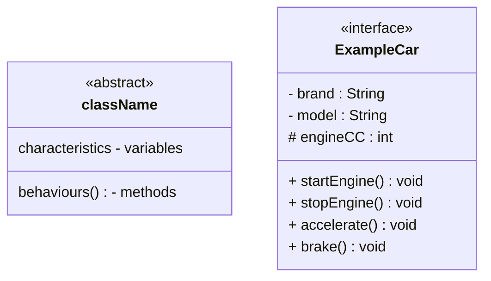
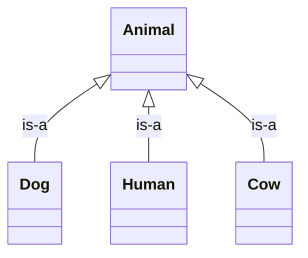
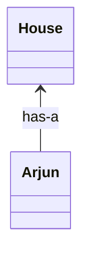
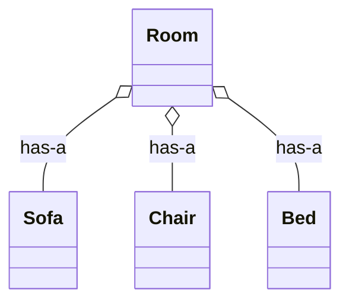
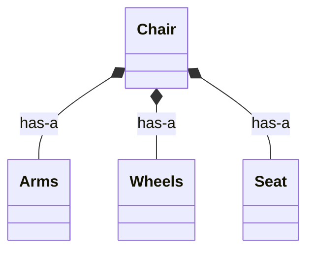
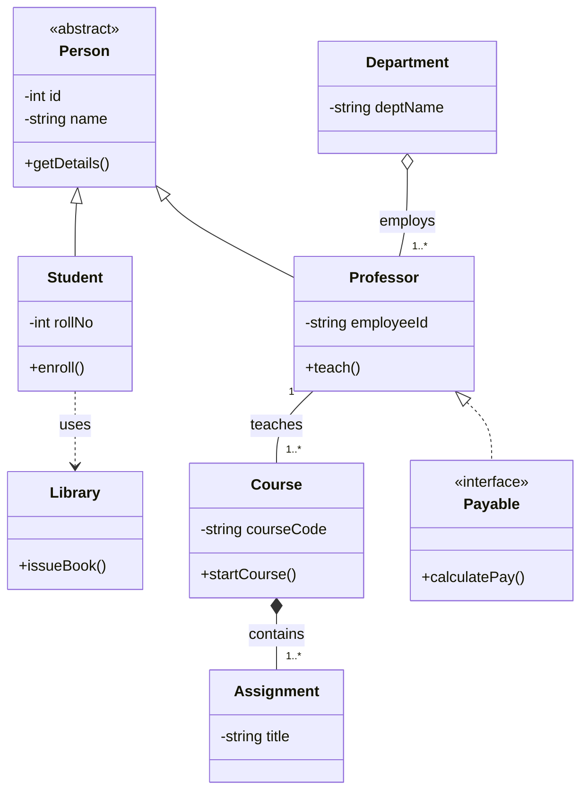
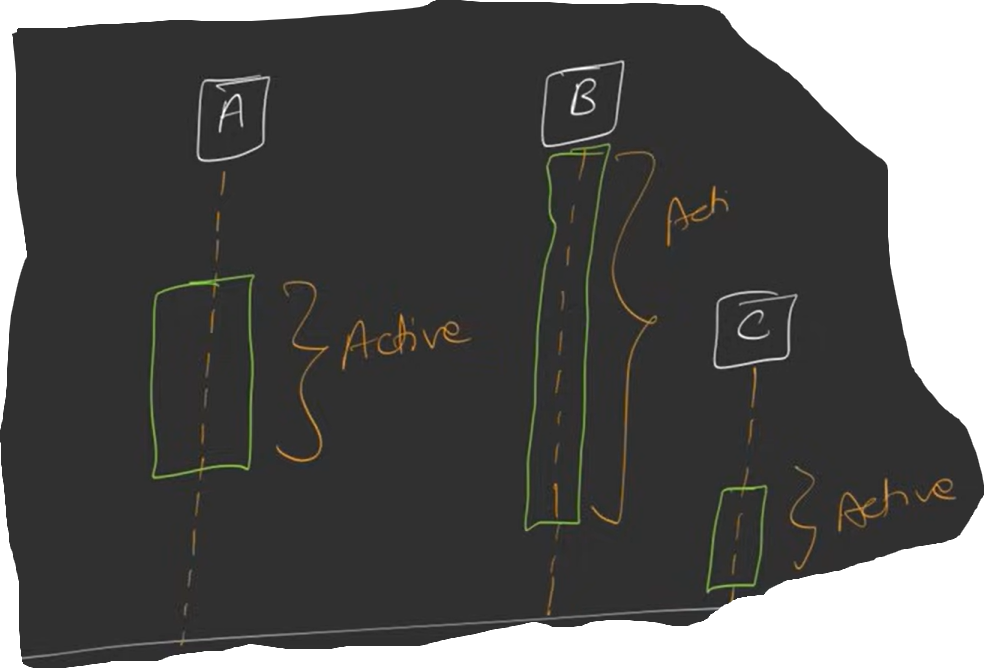
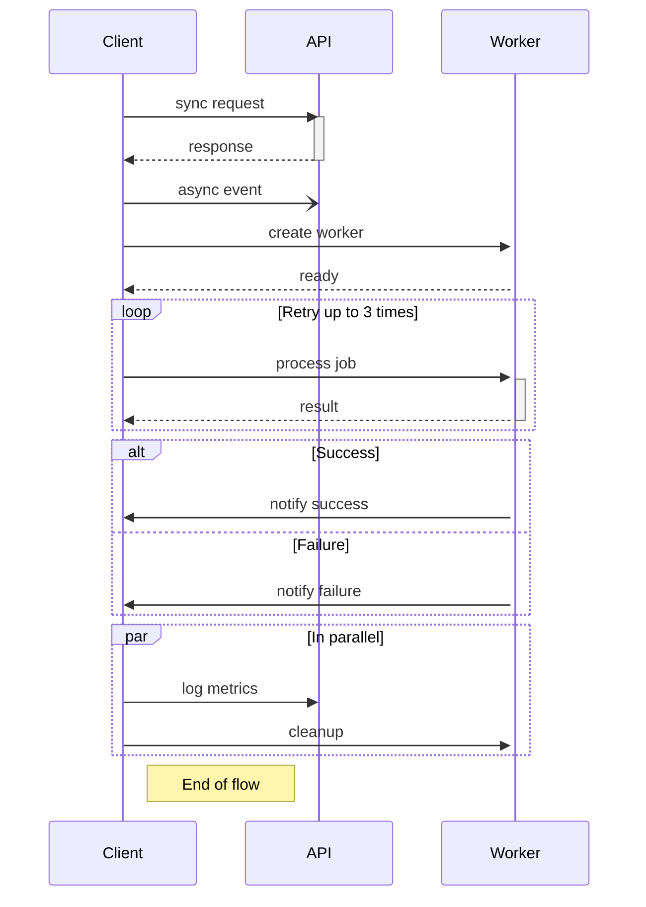
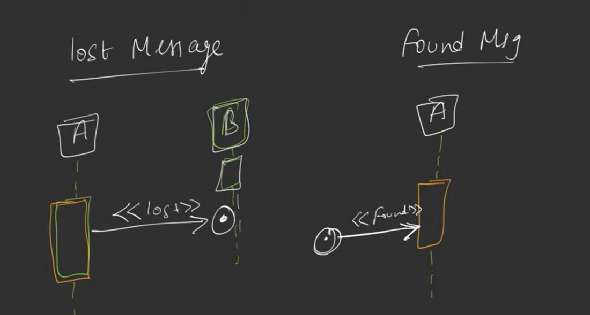
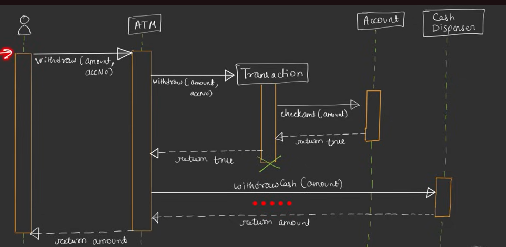

# UML Diagram
1. Structural (Static) : Structure of the applicaiton --> Total **7 Types**
2. Behavioural (dynamic) : how commponent communicate with each other  --> Total **7 Types**

## 1.1 Class Diagram
- class sturcture
- associates / connection

### Structure

#### Access Modifier
- public : `+`
- protected : `#`
- private : `-`

- <<abstract>> , <<interface>>

#### Associations
- Two types : `class association` and `object association`
- `class association` : `inheritance`
- `object association` : `simple association` , `aggregation`, `composition`

##### **a) inheritance** - (is-a) relationship
- Cow is a Animal, Human is a Animal 
- use `arrow` : --|>


##### **b) composition** - (has-a relationship)
```cpp
class A{
    public:
        auto method1(){}
};
class B{
    private: 
        A* a;

    public:
        B(){
            a = new A();
        }
        auto method2(){}
}
int main(){
    B* b = new B();
    b->method2();
    b->a->method1();    // We call a and then it call method1 : composition
}
```
**note** : In LLD we use composition more than inheritance

###### 1) Simple Association : [-->] 
Exmaple : Arjun lives in house , arjun --> house

###### 2) Aggregatoin : [--<>]
Room is a aggregator : sofa, chair, bed all inside room
<br>
Here `Chair`, `Sofa`, `Bed` are part of `Room` but they can live independently of Room as well


###### c) Composition : [--<> filled diamond]
Class is made of many other subclass and all subclass are dependent of parent class and can't live independently of parent class


#### Mermaid Example
Relationships Covered
| UML Concept | Used                              |
| ----------- | --------------------------------- |
| Inheritance | `Student`, `Professor` ← `Person` |
| Association | `Professor` — `Course`            |
| Aggregation | `Department` o-- `Professor`      |
| Composition | `Course` *-- `Assignment`         |
| Interface   | `Payable`                         |
| Dependency  | `Student ..> Library`             |




## 2.1 Sequence Diagram
Communication / Interaction between two Object
**Components**
Class (box), Lifeline, Activation Bar


**Messages**
Two type: asynchronous, synchronous
<br>
**Synchronous** [--|>]: reuest, wait , response
<br>
**Ashynchronous** [-->] : request, request, request, response, request, .... (don't wait for response)

<br>
**Create Message**
<br>
**Destroy Message**

| Syntax  | Meaning                      |
| ------- | ---------------------------- |
| `->>`   | Synchronous call             |
| `-->>`  | Return message               |
| `-)`    | Asynchronous message         |
| `->>+`  | Call + activate receiver     |
| `-->>-` | Return + deactivate receiver |





### Exmaple 
Use Case : User --> ATM --> Transaction --> Cash --> User
<br>
**Steps**:
- User Go to ATM
- Provide Account Detail (Pin, Card, etc)
- ATM create Transactoin
- Transaction get verified
- if Transaction Successful --> Cash Dispenser will be called
- Cash Dispenser provide cash to user

